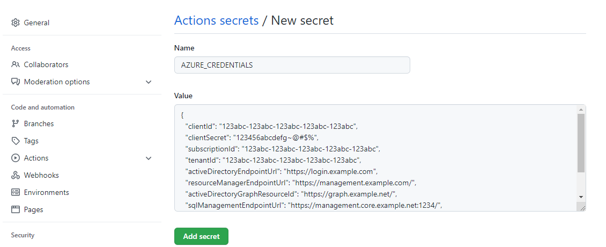

---
challenge:
    module: 
    challenge: 'Set-up'
---

# Set-up

To work on the challenges, go through the set-up first.

You'll need to create a GitHub repo with the necessary artifacts. Create a new repo by using the template of this repo.

Once you've created a GitHub repo with the necessary assets, you'll need to:

1. Create a resource group and service principal in the Azure portal.
2. Connect the GitHub repo to your Azure resource group.
3. Create an Azure Machine Learning workspace.
4. Create a dataset in your Azure Machine Learning workspace.

Follow the instructions below to complete the set-up.

## Create resource group and service principal in Azure portal

To create and group resources in Azure, you'll use a resource group. Next, you'll create a service principal in Azure that will have **contributor** access to that resource group. By copying the service principal's output over to GitHub, your repo will have Contributor access to the resource group in Azure.

1. Go to the Azure portal. 
2. Create a resource group with the name `rg-dev-mlops`. 

> **Note:**
> You can choose to use another resource group name. The default is assumed to be `rg-dev-mlops`. If you use another name, make sure to change the resource group name whenever necessary.

3. Open the Cloud Shell in the Azure portal.
4. Edit the following command and add your subscription id.

```
az ad sp create-for-rbac --name "github-aml-sp" --role contributor \
                            --scopes /subscriptions/<subscription-id>/resourceGroups/rg-dev-mlops \
                            --sdk-auth
```

5. Run the command to create a service principal named `github-aml-sp` that gets contributor access to your resource group.
6. **Copy and save the output** of the command. You'll use it in the next section to create a secret in GitHub.

## Connect GitHub with Azure resource group

To allow GitHub to create resources in the resource group in Azure, you'll create a GitHub secret that stores the information of the service principal.

1. Create a new **public** repo by using this repo as a template.

> **Note**:
> Set the repo to public. If the repo is private, you'll not be able to create environments unless your organization uses GitHub Enterpise Cloud.

2. Go to your new GitHub repo and navigate to the **Settings** tab.
3. Under **Security**, select **Secrets > Actions**. 
4. Create a **new repository secret**.
     - Name: **AZURE_CREDENTIALS**
     - Value: *Output of command to create service principal*.



## Create Azure Machine Learning workspace

To train, manage, and monitor models, you'll use an Azure Machine Learning workspace. You can use the GitHub Action in this repo to quickly create a workspace in your resource group.

1. Go to the **Actions** tab in your GitHub repo.
2. Choose **select workflow**.
3. Select the **Create Azure Machine Learning workspace** workflow.
4. Select **run workflow**. 

> **Note:**
> Change the default resource group name if necessary. Change the default name for the Azure Machine Learning workspace that will be created with this workflow if you want. You'll have to change the workspace name in future workflows as well. 

You'll get an email when the run has completed. If successful, the workflow will have created a new Azure Machine Learning workspace in your resource group. You can view the workspace (and related resources) in the Azure portal.

## Create a data asset in your Azure Machine Learning workspace

Store any code assets you create in the GitHub repo you manage. Although you'll find a CSV dataset in this repo, it's recommended to store your data in a cloud data store. Go through the following steps to copy the data over to the default data store of the Azure Machine Learning workspace. A **dataset** in the workspace will be created to store the connection information to the CSV stored in the Azure Blob Storage Account associated with your Azure Machine Learning workspace.

1. Go to the **Actions** tab in your GitHub repo.
2. Choose **select workflow**.
3. Select the **Create data asset** workflow.
4. Select **run workflow**. 

> **Note:**
> Change the default names for the resource group and workspace if you named your assets differently.

Once the workflow has completed successfully, you'll find a new dataset in your Azure Machine Learning workspace. 

## Local debugging

GitHub Actions are ideal for automating workflows. To test the workflow before you automate it, it's recommended to use a local debugging approach. As you'll be working with Azure Machine Learning mostly by using the CLI v2, there are two main ways you can test commands:

- **[Azure Cloud Shell](https://docs.microsoft.com/azure/cloud-shell/overview)**: Browser-based shell for managing Azure resources. 
- **[Visual Studio Code](https://code.visualstudio.com/download)**: Download for free to manage Azure resources from your local device.

Whether you choose to use the Azure Cloud Shell or Visual Studio code for debugging, make sure to install the Azure Machine Learning extension for CLI v2. To learn more about [how to install the extension and login to Azure](https://docs.microsoft.com/azure/machine-learning/how-to-configure-cli).
