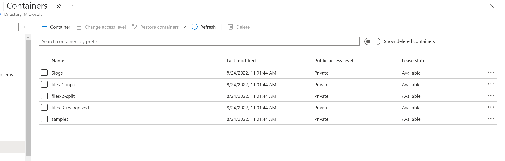
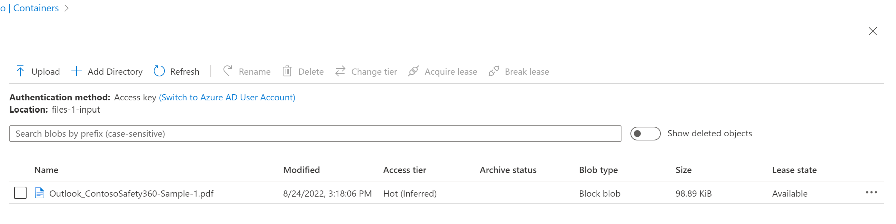

# Test the Solution Accelerator 
Once you have have successfully deployed and configurated the solution, follow below instructions to test the solution. 

## Step 1: Review Azure Data Lake Storage Containers

1. Go to the [Azure Portal](https://portal.azure.com) and select the Azure Storage Account that was created as part of the deployment process. 
2. Click the resource and get to its overview page. 
3. In the menu pane on the left, under `Data storage`, select `Containers`. You should see containers listed as below: 

## Step 2: Verify the Form Processing Logic App

1. From Azure portal, open the Form Processing Logic App interface and click 'Run Trigger'. 

2. Upload selected files from [Sample Test Forms](../data/samples/test/contoso_set_1) to azure data lake storage container `file-1-input`.

3. Examine azure storage container `files-2-split`. If successful, you should see results similar to the screen below:

   

4. Examine azure storage container `files-3-recognized`. If successful, you should see results similar to the screen below:

## Step 3: Verify the Outlook Logic App (Optional)

Please note: If your business does not receive forms as attachments with an designated outlook email, you can skip this step. The sole feature of this email logic app is to extract attached pdf forms and then upload them to Azure Data Lake Storage container '`files-1-input`'. The form processing logic app will pick up the uploaded forms for further processing.  

1. From Azure portal, open the Outlook Email Processing Logic App interface and click 'Run Trigger'. The Logic App should start working. 

2. To test, send an email with selected files from [Sample Test Forms](../data/samples/test/contoso_set_1) as attachment to the the outlook mailbox.

   `Note: The attachment should be less than 3MB in order for the Logic App to work`.

3. If successful, the `attachment` is uploaded to the azure data lake storage container `files-1-input`, you will see results similar to below.  

