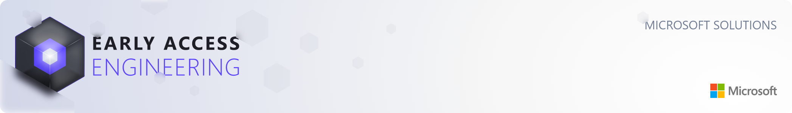
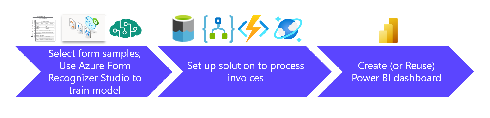

# Azure PDF Form Processing Automation Solution Accelerator

Form processing is a critical business function across industries. Many companies are still relying on manual processes, which are costly, time-consuming, and error prone. Replacing these manual processes not only reduces a company’s cost and risk but is also an essential part of a company’s digital transformation journey. 

This solution accelerator empowers companies to automate the processing of PDF forms to modernize their operations, save time, and reduce cost.

The solution accelerator receives the PDF forms, extracts the fields from the form, and saves the data in Azure Cosmos DB. Power BI is then used to visualize the data.

The solution accelerator was designed with a modular, metadata-driven methodology. It can be utilized directly without code modification to process and visualize any single-page PDF forms such as safety forms, invoices, incident records, health screening forms, payment authorization forms, and many others.

To use the solution accelerator, you only need to collect sample PDF forms, train a new model to learn the form's layout and plug the model into the solution. The Power BI report will need to be re-designed for your specific data sets to drive insights.

**Who can leverage this solution?** Businesses have many types of single-page forms to be processed and analyzed. For example, safety forms, invoices, incident records, housing application forms, credit card application forms, job applications forms, and many others.

**Outcome of the solution**: Key data fields are extracted from many single-page PDF forms, stored in Azure Data Lake Storage and Cosmos DB. The data is visualized in dashboard pages to drive actionable insights. 

**Possible extension**: Businesses can utilize data fields stored in Azure Data Lake Storage or Azure Cosmos DB to perform further processing. For example, if safety forms are processed, the data can be used for work place safety analysis, incident analysis, and compliance reporting. If invoices are processed, the processed data can be used for invoice payment applications. 

**What are the input?** Input to this solutions are (1) single-page pdf forms or (2) multiple page pdf documents with each page as a self-contained form. In this case, the solution has a 'split pdf file' feature to split the multiple page pdf file into single-page pdf forms. 

**Limitations:** Each PDF form must fit into **a single page pdf file**. If the PDF file contains multiple pages, the system assumes that each page is a self-contained PDF form, and will split the multi-page PDF file into single pages before processing. After splitting, each split file will be only one page, containing a single form. Please review the sample files posted here to see the format: [Single Page PDF File Sample](./Deployment/Data/samples/test/contoso_set_1/ContosoSafety360-Sample-1.pdf) and [Multi Page PDF File Sample](./Deployment/Data/samples/test/contoso_set_1/ContosoSafety360-Combo-1.pdf).

**How to deploy and test the solution?**  The solution is supplied with sample manufacture safety forms, form recognizer labeled files, and a Power BI model. Please follow the step by step [Deployment Guide](./Deployment/README.md) to deploy and set up the solution to your own Azure subscription, test the solution with the test forms supplied, and then visualized the data using the Power BI model supplied. 

**Key Azure technologies** utilized in this solution are:  Azure Data Lake Storage,  Azure Form Recognizer, Azure Logic Apps, Azure Functions App, Azure Cosmos DB, and Power BI.  **The Azure Form Recognizer** is a cloud-based Azure Applied AI service that uses machine learning models to extract and analyze fields, text, and tables from documents or images. **Azure Logic App** is a cloud-based platform for creating and running automated end-to-end workflows. **Azure Functions App** provides low-cost, custom application logic development and data processing capabilities to help businesses solve complex problems with ease of design, development, deployment, and maintenance. **Azure Cosmos DB** is a fully managed, serverless NoSQL database for high-performance applications of any size or scale. 

## Prerequisites

To use this solution accelerator, you will need access to an [Azure subscription](https://azure.microsoft.com/en-us/free/). An understanding of Azure Form Recognizer, Azure Form Recognizer Studio, Azure Logic Apps, Azure Functions, Azure Cosmos DB, and Power BI will be helpful. 

For additional training and support, please review:

1. [Azure Form Recognizer](https://azure.microsoft.com/en-us/services/form-recognizer/)
2. [Azure Logic Apps](https://azure.microsoft.com/en-us/services/logic-apps/#overview)
3. [Azure Functions](https://docs.microsoft.com/en-us/azure/azure-functions/functions-overview)
4. [Azure Data Lake Storage](https://docs.microsoft.com/en-us/azure/storage/blobs/data-lake-storage-introduction)
5. [Azure Cosmos DB](https://azure.microsoft.com/en-us/services/cosmos-db/)
6. [Power BI](https://docs.microsoft.com/en-us/power-bi/fundamentals/power-bi-overview)

## Getting Started
Get started by deploying the solution accelerator to a specified resource group in your own subscription. Go to the [Deployment Guide](./Deployment/README.md) to set up your Azure environment, create necessary Azure resources, and test the solution. 

## Architecture
Below architecture diagram illustrates the main components and information flow of this solution accelerator. For the work flow details, please refer to the page for [Architecture Description](./Deployment/Architecture_Description/README.md). 

## Power BI Dashboard

Below Power BI dashboard illustrates overview of sample safety form processing results, showing the number of occurrences by selected categories. The category is the field key defined by the Azure Form Recognizer labeling tool.  

In addition, you can have a quick overview of the safety forms categorized by important fields such as Department, Owner, Date created. From these charts, you can recognize patterns and trends, as illustrated below. 

## License
MIT License

Copyright (c) Microsoft Corporation.

Permission is hereby granted, free of charge, to any person obtaining a copy
of this software and associated documentation files (the "Software"), to deal
in the Software without restriction, including without limitation the rights
to use, copy, modify, merge, publish, distribute, sublicense, and/or sell
copies of the Software, and to permit persons to whom the Software is
furnished to do so, subject to the following conditions:

The above copyright notice and this permission notice shall be included in all
copies or substantial portions of the Software.

THE SOFTWARE IS PROVIDED "AS IS", WITHOUT WARRANTY OF ANY KIND, EXPRESS OR
IMPLIED, INCLUDING BUT NOT LIMITED TO THE WARRANTIES OF MERCHANTABILITY,
FITNESS FOR A PARTICULAR PURPOSE AND NONINFRINGEMENT. IN NO EVENT SHALL THE
AUTHORS OR COPYRIGHT HOLDERS BE LIABLE FOR ANY CLAIM, DAMAGES OR OTHER
LIABILITY, WHETHER IN AN ACTION OF CONTRACT, TORT OR OTHERWISE, ARISING FROM,
OUT OF OR IN CONNECTION WITH THE SOFTWARE OR THE USE OR OTHER DEALINGS IN THE
SOFTWARE

## Note about Libraries with MPL-2.0 License
The following libraries are not explicitly included in this repository, but users who use this Solution Accelerator may need to install them locally and in Azure Functions to fully utilize this Solution Accelerator. However, the actual binaries and files associated with the libraries are not included as part of this repository, but they are available for installation via the PyPI library using the pip installation tool.

Libraries: certifi

## Contributing
This project welcomes contributions and suggestions.  Most contributions require you to agree to a Contributor License Agreement (CLA) declaring that you have the right to, and actually do, grant us the rights to use your contribution. For details, visit https://cla.opensource.microsoft.com.

When you submit a pull request, a CLA bot will automatically determine whether you need to provide a CLA and decorate the PR appropriately (e.g., status check, comment). Simply follow the instructions provided by the bot. You will only need to do this once across all repos using our CLA.

This project has adopted the [Microsoft Open Source Code of Conduct](https://opensource.microsoft.com/codeofconduct/). For more information see the [Code of Conduct FAQ](https://opensource.microsoft.com/codeofconduct/faq/) or contact [opencode@microsoft.com](mailto:opencode@microsoft.com) with any additional questions or comments.

## Trademarks
This project may contain trademarks or logos for projects, products, or services. Authorized use of Microsoft trademarks or logos is subject to and must follow [Microsoft's Trademark & Brand Guidelines](https://www.microsoft.com/en-us/legal/intellectualproperty/trademarks/usage/general). Use of Microsoft trademarks or logos in modified versions of this project must not cause confusion or imply Microsoft sponsorship. Any use of third-party trademarks or logos are subject to those third-party's policies.

## Data Collection
The software may collect information about you and your use of the software and send it to Microsoft. Microsoft may use this information to provide services and improve our products and services. You may turn off the telemetry as described in the repository. There are also some features in the software that may enable you and Microsoft to collect data from users of your applications. If you use these features, you must comply with applicable law, including providing appropriate notices to users of your applications together with a copy of Microsoft's privacy statement. Our privacy statement is located at https://go.microsoft.com/fwlink/?LinkID=824704. You can learn more about data collection and use in the help documentation and our privacy statement. Your use of the software operates as your consent to these practices.
