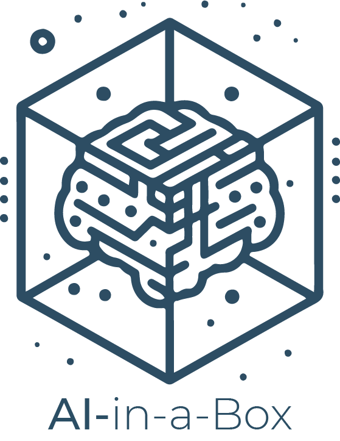
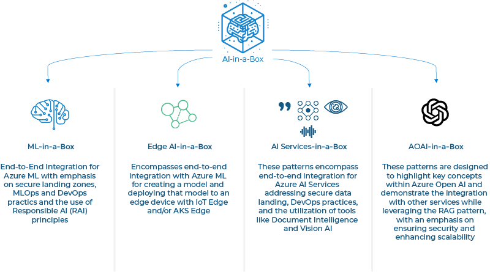

# AI-in-a-Box

  

Embarking on an Azure AI/ML journey can appear challenging for certain organizations and engineers, often leading to roadblocks in their initial scenarios. To address this challenge, providing a user-friendly and intuitive template becomes crucial.  Such a template should serve as a guiding example, illustrating the complete AI/ML/LLM lifecycle, showcasing the integration of MLOps practices, detailing the setup of training pipelines, offering insights into the processes of model training, deployment, access control, and integration with other services. This ensures a smoother and more comprehensible transition into the world of Azure AI and ML.

<i>AI-in-a-Box</i> aims to provide an "Azure AI/ML <i>Easy Button</i>" for common scenarios within Azure ML, Edge AI, Cog Services and Azure OpenAI. Something that shows you how the pieces fit together in easy to deploy templates. Using the **patterns** available here, engineers will be able to quickly setup an Azure ML/AI Edge/Cog Services and/or Azure Open AI environment which optionally includes data ingestion, model training and creation, scaling patterns and edge deployments. So, if you’re seeking to shed some light into the realm of Azure ML/AI and Open AI, you’ve come to the right spot.

  

## Available Patterns

|Pattern|Description|Category|Supported Use Cases and Features|
|---|---|---|---|
|[Azure ML Operationalization in-a-box](./machine-learning/ml-ops-in-a-box)|Boilerplate Data Science project from model development to deployment and monitoring | ML-in-a-Box |<li>End-to-end MLOps project template <li>Outer Loop (infrastructure setup)   <li>Inner Loop (model creation and deployment lifecycle)|
|[Cognitive Services Landing Zone in-a-box](./ai-services/ai-landing-zone)|Minimal enterprise-ready networking and AI Services setup to support most Cognitive Services scenarios in a secure environment| AOAI-in-a-Box |<li>Hub-and-Spoke Vnet setup and peering   <li>Cognitive Service deployment   <li>Private Endpoint setup   <li>Private DNS integration with PaaS DNS resolver|
|[Doc Intelligence in-a-box](./ai-services/doc-intelligence-in-a-box) | This accelerator enables companies to automate PDF form processing, modernize operations, save time, and cut costs as part of their digital transformation journey. | AI Services-in-a-Box |<li>Receive PDF Forms  <li>Function App and Logic App for Orchestration  <li>Document Intelligence Model creation for form processing and content extraction   <li> Saves PDF data in Azure Cosmos DB |
|[Semantic Kernel Bot in-a-box](./gen-ai/semantic-kernel-bot-in-a-box)|Extendable solution accelerator for advanced Azure OpenAI Bots| AOAI-in-a-Box |<li>Deploy Azure OpenAI bot to multiple channels (Web, Teams, Slack, etc)   <li>Built-in Retrieval-Augmented Generation (RAG) support   <li>Implement custom AI Plugins|

## Key contacts

| Contact | GitHub ID | Email |
|--------------|------|-----------|
| Alex Morales | @msalemor | alemor@microsoft.com |
| Andrés Padilla | @AndresPad | andres.padilla@microsoft.com | 
| Chris Ayers | @codebytes | chrisayers@microsoft.com |
| Eduardo Noriega | @EduardoN | ednorieg@microsoft.com |
| Jean Hayes | @jehayesms | jean.hayes@microsoft.com |
| Marco Aurélio Bigélli Cardoso  | @MarcoABCardoso | macardoso@microsoft.com | 
| Maria Vrabie  | @MariaVrabie | mavrabie@microsoft.com | 
| Neeraj Jhaveri | @neerajjhaveri | neeraj.jhaveri@microsoft.com |
| Thiago Rotta | @rottathiago | thiago.rotta@microsoft.com |
| Victor Santana | @Welasco | vsantana@microsoft.com |
