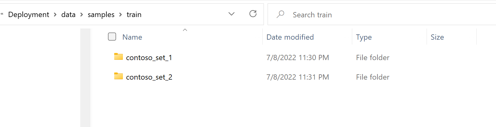

# Create Form Recognizer Machine Learning Model 
Follow the steps below to train a form recognizer composite machine learning (ML) model. This also includes the steps to train a non-composite ML model. 

## Step 1: Locate the Sample Data Files
After finishing the deployment process described in [Deployment Scripts Guide](../1_deployment_scripts/README.md), your form recognizer resource should be ready for you to start creating new Form Recognizer ML model. From your cloned repository, navigate to the project root directory then to `Deployment\Data\samples\train`

You will see two folders that contain sample training forms, as illustrated below. 

## Step 2: Upload Sample Forms to Azure Data Lake Storage
1. Go to the [Azure Portal](https://portal.azure.com) and select the Azure Data Lake Storage Account that was created by deployment script. 
2. On the left side of the menu pane, select `Data storage`, then `Containers` and go to the `samples` container. 
3. Create a new folder and name it `train`.  
4. In the `train` folder, create two folders. One named `contoso_set_1` and the other named `contoso_set_2`.  
5. Upload the sample labeling files in [Data/samples/train/contoso_set_1](../Data/samples/train/contoso_set_1) and [Data/samples/train/contoso_set_2](../Data/samples/train/contoso_set_2)  into the corresponding folders. You now have two full sets of pre-labeled data to create the machine learning models. 

### Step 3: Train and Merge Form Recognizer ML Models  
In this step you will train custom Azure Form Recognizer ML models and merge them into a composite model. For more information, please refer to Azure online document [Compose Custom Models v3.0](https://docs.microsoft.com/en-us/azure/applied-ai-services/form-recognizer/compose-custom-models-v3?tabs=studio).
1. Go to [Form Recognizer Studio](https://formrecognizer.appliedai.azure.com/studio), scroll down to  `Custom Model` and select `Create new`, as illustrated below. 

2. Select `+Create a project` to create a project. 
3. Enter a project name. For example `SafetyFormProject-Set-1` or any other project name of your choice.
4. Enter a project description. For example `Custom form recognizer model with samples contoso_set_1` and click `Continue`.
5. Select your Subscription, Resource Group and Azure Form Recognizer created by the deployment scripts [main-deploy.ps1](../1_deployment_scripts/main-deploy.ps1). 
6. Select the latest API Version. This solution was tested with API version 2022-08-31, as illustrated below. Click `Continue`.
7. Now you will be prompted to enter the training data source, as illustrated below. Select your subscription. Select Resource Group, and Azure storage created by the deployment scripts [main-deploy.ps1](../1_deployment_scripts/main-deploy.ps1). Enter `samples` in the Blob container field. Enter `train/contoso_set_1` in the Folder path field. Click `Continue`. 

8. Review Information and click `Create Project`. This step connects the form recognizer studio to Azure data lake storage/container resource in your subscription to access the training data. 
9. After the project is created, forms with OCR, field key and value pair will appear as illustrated below. Click '`Train`' on upper right corner, 

10.  Fill in information as below, and select the dropdown "Build Mode" to `Template`, and then click `Train`. 

11. Once the training for `contoso_set_1` samples is done, the model will be located in `Models` tab with confidence score of each field, as illustrated below.

12. Train second model with files stored in `train/contoso_set_2`, using above steps. Name your second model as `consoto-set-2` or choice of your own. Click 'Models' from your project, you will see a list of models already created. You can now merge individual models into a composite model. Select `contoso-set-1` and `contoso-set-2`, then click `Compose`. The system will prompt you for a new model name and description. Enter `contoso-safety-forms` or choice of your own, with a description. Click `Compose`. 

13. Now your model id `contoso-safety-forms` will appear in the Model ID list, as illustrated below. Please make a note of this composed model id as you will need it to set up the Azure Functions App to use this model id, as described in [Solution Configuration Guide](../3_solution_configuration/README.md). 

