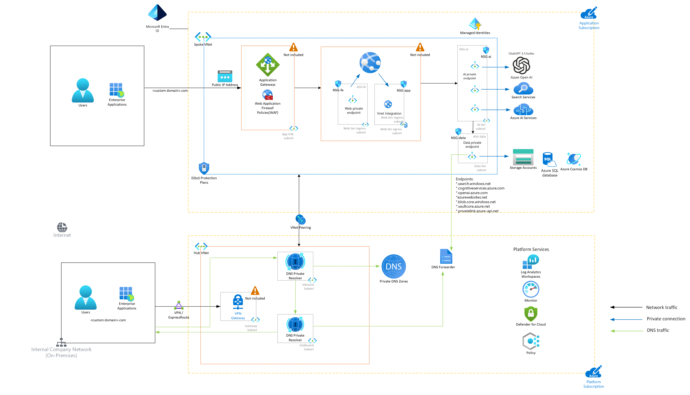

# Cognitive Services Landing Zone in-a-box


## What's in this box?

This deployment template contains a minimal Landing Zone configuration that enables:

- Cognitive services that implement a wide range of Natural Language functionality, including Azure OpenAI, Document Intelligence and AI Search;
- Hub-and-Spoke network configuration;
- Private endpoint connectivity between Azure services;
- DNS Resolver and Private DNS Zones to enable domain name resolution within the Vnets;
- App Services with Vnet integration to host custom applications which rely on Cognitive Services.

## What's not included in the box?

The template does _not_ implement:

- Connectivity to/from on-premises resources. See [Hybrid Networking](https://learn.microsoft.com/en-us/azure/architecture/reference-architectures/hybrid-networking/) for guidance on setting up ExpressRoute or VPN; 
- Azure Firewall integration. See the [Azure Firewall Tutorial](https://learn.microsoft.com/en-us/azure/firewall/tutorial-firewall-deploy-portal-policy) for more information;
- An AI-infused application. See sample usage at the end of this page for examples of applications you can deploy.


## Solution Architecture

The solution architecture is described in the diagram below.



## Pre-requisites
1. Install Azure CLI (https://docs.microsoft.com/en-us/cli/azure/install-azure-cli)
1. Install the Azure Developer CLI (https://learn.microsoft.com/en-us/azure/developer/azure-developer-cli/install-azd)
1. Ensure Microsoft.CognitiveServices Resource Provider is registered within Azure  
[Register a Resource Provider](https://learn.microsoft.com/en-us/azure/azure-resource-manager/management/resource-providers-and-types) and that your subscription is enabled for Azure OpenAI
1. Clone repository / copy files locally
```
git clone https://github.com/Azure/AI-in-a-Box
cd cognitive-services-landing-zone-in-a-box
```
1. Log in to Azure and Azure Developer CLI
```
az login
azd auth login
```

## Deploy to Azure

```
azd up
```

## Sample usage

You can deploy most Azure OpenAI samples from GitHub with private connectivity enabled using this accelerator. See the examples below:

### 1. Deploy the "Sample Chat App with AOAI" privately

This sample can be deployed directly from the Azure OpenAI Studio.

1. Deploy this sample with Azure AI Search enabled. Document Intelligence and Cosmos DB are not required.
2. Go to https://oai.azure.com
3. Go to the Chat Playground
4. Configure your assistant with a system prompt and a data connection
5. Click Deploy to -> A new web App
6. Choose "Create a new web app" and follow the prompts to deploy. Private network integration is not supported on the F1 SKU.
7. Once deployed, go to your App Services instance and enable the Vnet integration feature. You will need to create a /27 subnet under the spoke Vnet and delegate it to App Service.
8. You may also disable public network access to the application and add a private endpoint. Keep in mind that you will need VPN / ExpressRoute connectivity to be able to access the application in this case.
9. At this time, it is not possble to reuse an existing CosmosDB account. If you enable Chat History, a new CosmosDB account is created. Create a private endpoint for it on the PrivateEndpoints subnet of the Spoke Vnet, and disable public network access.
10. Go to your app and start chatting!

### 2. Deploy the "ChatGPT + Enterprise data with Azure OpenAI and AI Search" privately

This sample is available on GitHub.

1. Deploy this sample with Azure AI Search enabled. Document Intelligence and Cosmos DB are not required.
2. Go to https://github.com/Azure-Samples/azure-search-openai-demo;
3. If using the tool to chunk and upload documents, temporarily enable public network access before running `azd up`. You may also run this process privately if you establish a VPN / ExpressRoute connection;
4. Follow the instructions under "Deploying with existing Azure resources". Make sure to set up an existing Azure OpenAI and Azure AI Search;
5. Create a subnet for the application (at least /27 segment) and use the Vnet integration for your application. Optionally disable public network access to the app.
6. Go to your app and start chatting!

### 3. Deploy the Semantic Kernel Bot in-a-box pattern privately

The [Semantic Kernel Bot in-a-box](/gen-ai/semantic-kernel-bot-in-a-box) sample is compatible with this template. See the README for integration instructions.
