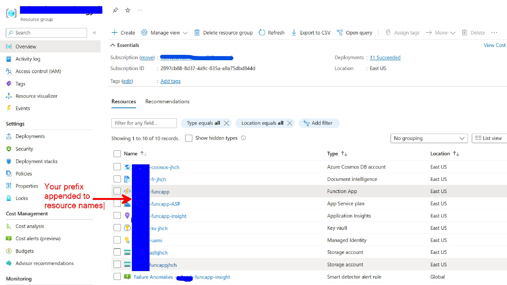

# Deploy Azure Resources for the Document Intelligence Accelerator

The **1_infra** folder contains the Bicep code and modules for deploying the resources needed for this Document Intelligence Solution. After creating a Resource Group and running the Bicep deployments, your resource group will contain the following resources:


## Prerequisites:

 1. Install latest version of [Azure CLI](https://docs.microsoft.com/en-us/cli/azure/install-azure-cli-windows?view=azure-cli-latest)
 1. Install latest version of [Bicep](https://docs.microsoft.com/en-us/azure/azure-resource-manager/bicep/install)
 1. Install latest version [Azure Functions Core Tools](https://docs.microsoft.com/en-us/azure/azure-functions/functions-run-local?tabs=v4%2Cwindows%2Ccsharp%2Cportal%2Cbash#v2)
 1. Clone this repo

## Deploy Azure Resources

1. Make sure you are in the **\1_infra** directory in bash
1. Login to your Azure account:  

    ```bash

         az login
    ```

1. Set your Azure subscription ID:  

    ```bash

    az account set --subscription <subscription id>
    ```

1. Create an Azure Resource group:

    ```bash

     az group create --name <your resource group name> --location <your resource group location>
    ```

1. Run command to get the object id for your email address. This is to give you access needed for deployed resources:

    ```bash
    az ad user show --id 'your email' --query id
    ```

1. Copy the objectid value returned from the above command.
1. Open the main.bicepparam and paste the object for the parameter value for **spObjectId**.  = 'your-object-id'. Also add the values for **resourceLocation**, **resourceGroupName**, **prefix**, and **uniqueSuffix**.
1. Save the main.bicepparam file.

    ```bash

    az deployment group create --resource-group <your resource group name>  --template-file main.bicep --parameters main.bicepparam --name Doc-intelligence-in-a-Box --query 'properties.outputs' 
    ```

1. Deploy code to function app (the name should be yourprefix-funcapp):  

   ```bash

    cd ..
    cd code
    func azure functionapp publish <your funcapp name> --python

    ```
