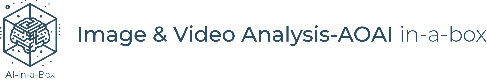
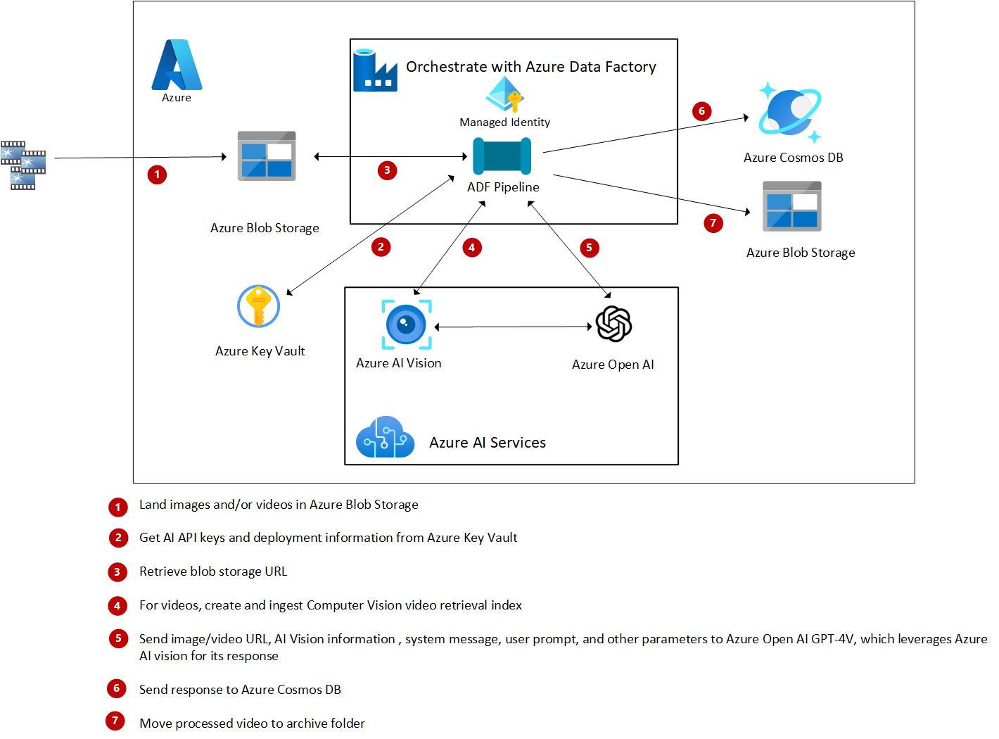
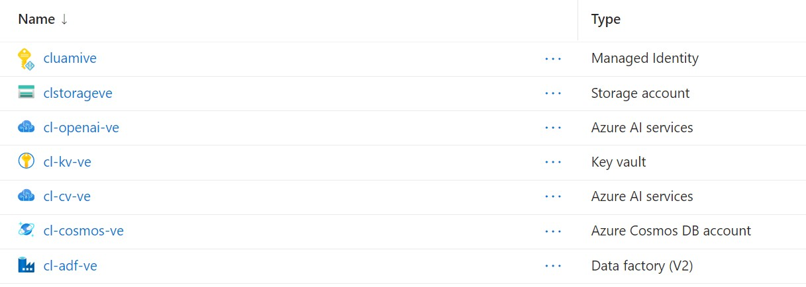
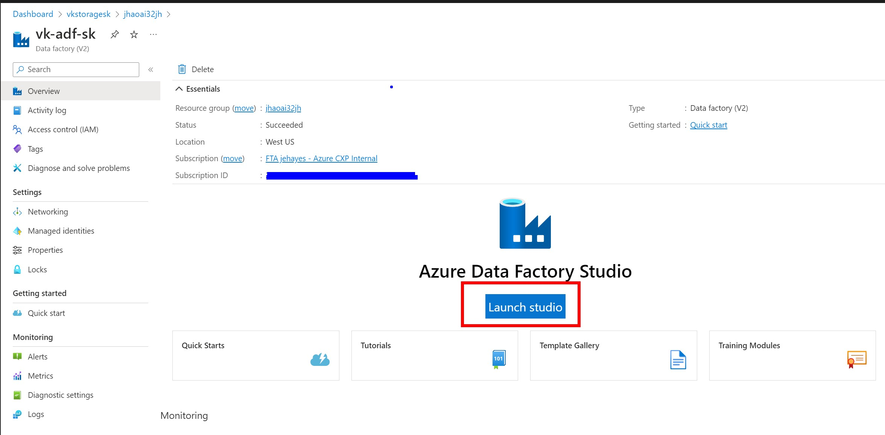
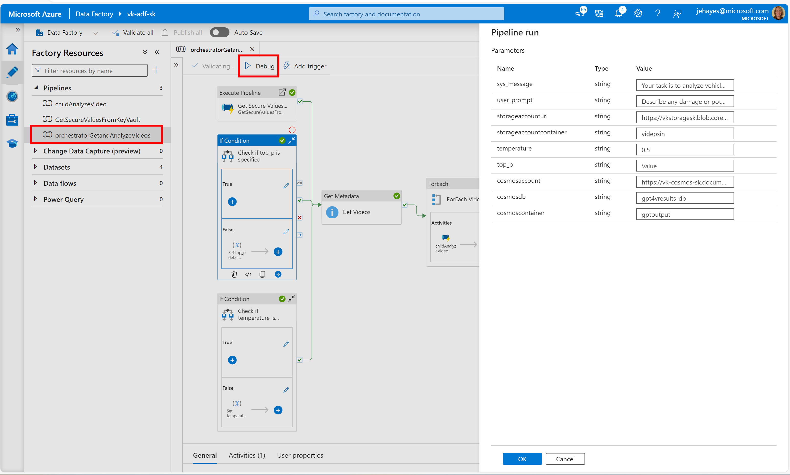
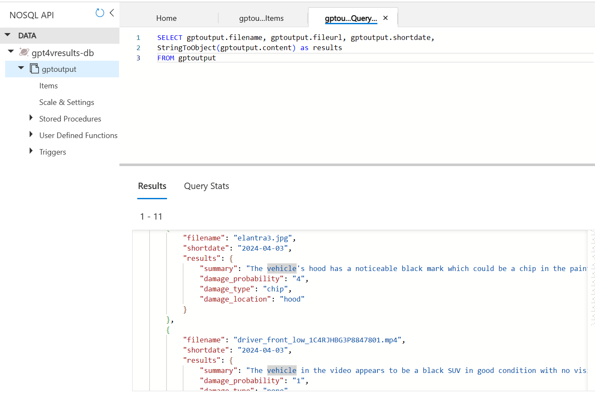
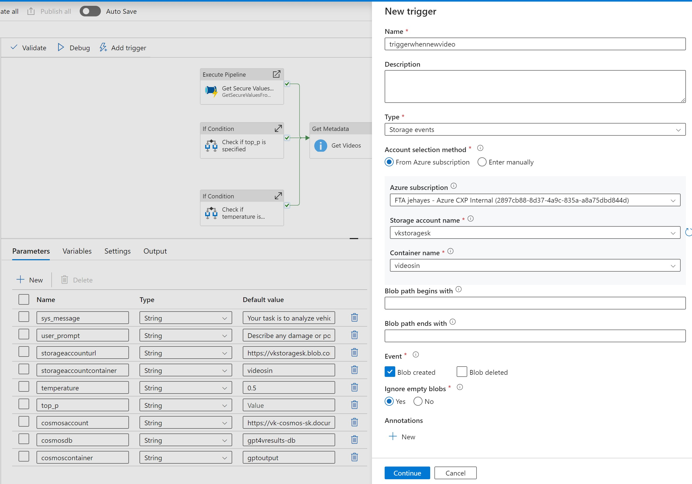
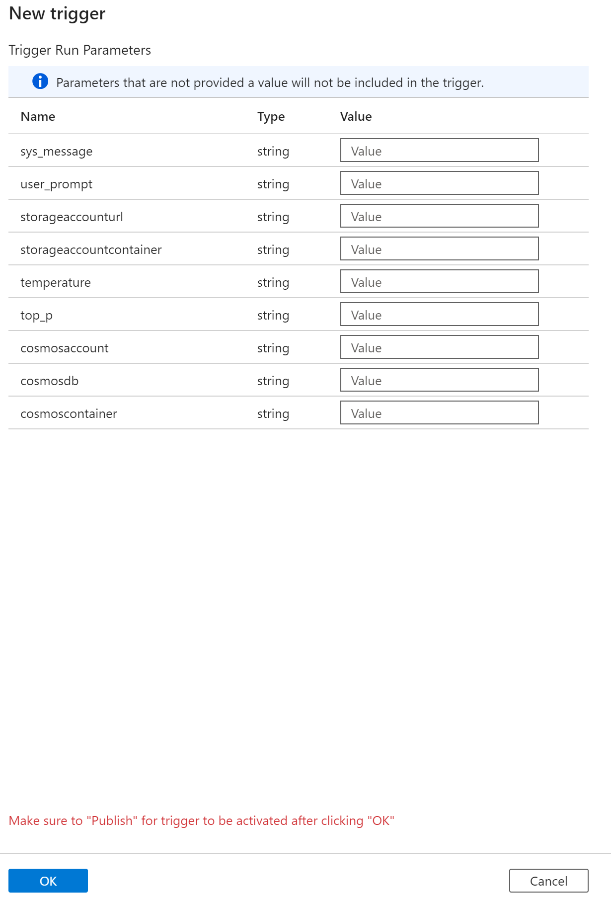

# Video Analysis-Azure Open AI in-a-box

This solution examines vehicles for damage using Azure Open AI GPT-4 Turbo with Vision and Computer Vision Image Analysis 4.0. All orchestration is done with Azure Data Factory, allowing this solution to be easily customized for your own use cases.

Please note that as of this 1/31/2024, Azure Open AI GPT-4 Turbo with Vision and Computer Vision Image Analysis 4 are in Public Preview for limited regions.

- [Check here for available regions for Computer Vision Image Analysis 4.0.](https://learn.microsoft.com/en-us/azure/ai-services/computer-vision/overview-image-analysis?tabs=4-0#image-analysis-versions)
- [Check here for available regions for GPT-4 Turbo with Vision.](https://learn.microsoft.com/en-us/azure/ai-services/openai/concepts/models#gpt-4-and-gpt-4-turbo-preview-model-availability)

## Solution Architecture



1. Land videos in Azure Blob storage with Azure Event Grid, Azure Logic Apps, Azure Functions, other ADF pipelines or other applications.
1. The ADF pipeline retrieves the Azure AI API endpoints, keys and other configurations from Key Vault.
1. The blob storage URL for the video file is retrieved.
1. With Azure Computer Vision, a video retrieval index is created for the file and the video is ingested. Depending on your use case, you could ingest multiple videos to the same index.
1. Call GPT4-V deployment in Azure Open AI, passing in video URL and the video retrieval index, system message, system prompt and other inputs.
1. Save the response to Azure Cosmos DB.
1. If the video processes successfully, move the video to an archive folder.

## Resources Deployed in this solution



- User Assigned Managed Identity which has access to all resources
- Storage account and containers for input videos and processed videos. Additionally, a SAS key is created which is required at this time for Azure Computer Vision Image Analyis 4.0.
- Azure Key Vault for holding API keys, the storage SAS token, and deployment information.
- Azure Computer Vision with Image Analysis 4.0 for video ingestion. Note that at this time Image Analysis 4.0 is in Preview and in limited regions. [Check here for available regions.](https://learn.microsoft.com/en-us/azure/ai-services/computer-vision/overview-image-analysis?tabs=4-0#image-analysis-versions)
- Azure Open AI resource with a GPT-4 Vision Preview Deployment. [Check here for available regions.](https://learn.microsoft.com/en-us/azure/ai-services/openai/concepts/models#gpt-4-and-gpt-4-turbo-preview-model-availability)

## Prerequisites

 1. Install latest version of [Azure CLI](https://docs.microsoft.com/en-us/cli/azure/install-azure-cli-windows?view=azure-cli-latest)
 1. Install latest version of [Bicep](https://docs.microsoft.com/en-us/azure/azure-resource-manager/bicep/install)
 1. Install latest version [Azure Functions Core Tools](https://learn.microsoft.com/en-us/azure/azure-functions/functions-run-local?tabs=windows%2Cisolated-process%2Cnode-v4%2Cpython-v2%2Chttp-trigger%2Ccontainer-apps&pivots=programming-language-python#v2)
 1. Clone this repo

## Deploy Azure Resources

1. Navigate to the **infra** directory in your local repo
1. Login to your Azure account:  

    ```bash
         az login
    ```

1. Set your Azure subscription ID:

    ```bash
    az account set --subscription <subscription id>
    ```

1. Create an Azure Resource group in the same region that is supported by Azure OpenAI GPT-4V:

    ```bash
     az group create --name <your resource group name> --location <your resource group location>
    ```

1. Run command to get the object id for your email address. This is to give you access needed for deployed resources:

    ```bash
     az ad user show --id 'your email' --query id
    ```

1. Copy the objectid value returned from the above command.
1. Open file main.bicepparam
    1. For **spObjectId**, paste the id value from the previous command over 'your-object-id'.
    1. Add value for your **resourceGroupName**.
    1. For **resourceLocation**, specify a region where GPT-4 Turbo with Vision is available.
    1. For **resourceLocationCV**, specify a region where Computer Vision with Image Analysis 4.0 is available.
    1. Add 2 or 3 alpha characters for both  **prefix**, and **suffix**. Some of the resources require unique names across Azure and cannot be the same as a soft-deleted resource.
1. Save the main.bicepparam file.

## Deploy resources to Azure

1. Navigate to the **infra** folder and run the following command:

    ```bash
    az deployment group create --resource-group <your resource group name>  --template-file main.bicep --parameters main.bicepparam
    ```

1. Upload videos of vehicles to your new storage account's **videosin** container using [Azure Storage Explorer](https://learn.microsoft.com/en-us/azure/vs-azure-tools-storage-manage-with-storage-explorer), [AzCopy](https://learn.microsoft.com/en-us/azure/storage/common/storage-use-azcopy-files#upload-the-contents-of-a-directory) or within [the Azure portal](https://learn.microsoft.com/en-us/azure/storage/blobs/storage-quickstart-blobs-portal#upload-a-block-blob). You can find some sample videos at the bottom of this blog, [Analyze Videos with Azure Open AI GPT-4 Turbo with Vision and Azure Data Factory](https://techcommunity.microsoft.com/t5/fasttrack-for-azure/analyze-videos-with-azure-open-ai-gpt-4-turbo-with-vision-and/ba-p/4032778).

## Run the solution

1. In the Azure portal, go to your newly created Azure Data Factory Resource and click launch:


1. Select the **orchestratorGetandAnalyzeVideos** pipeline, click **Debug**, and examine your preset pipeline parameter values. Then click OK to run.


1. After it runs successfully, go to your Azure Cosmos DB resource and examine the results in Data Explorer:


1. Because the way the system message was instructed to format the results, we can run queries with expressions like the one below to easily see the probability of damage, the severity of any damage, and the kind of damage that occurred:


```sql
SELECT gptoutput.filename, gptoutput.fileurl, gptoutput.shortdate,
SUBSTRING(gptoutput.content, INDEX_OF(gptoutput.content, "Location[") + 9, INDEX_OF(gptoutput.content, "]", INDEX_OF(gptoutput.content, "Location[") + 9) - INDEX_OF(gptoutput.content, "Location[") - 9) AS Location,
SUBSTRING(gptoutput.content, INDEX_OF(gptoutput.content, "VehicleType[") + 12, INDEX_OF(gptoutput.content, "]", INDEX_OF(gptoutput.content, "VehicleType[") + 12) - INDEX_OF(gptoutput.content, "VehicleType[") - 12) AS VehicleType,
SUBSTRING(gptoutput.content, INDEX_OF(gptoutput.content, "DamageProbability[") + 18, INDEX_OF(gptoutput.content, "]", INDEX_OF(gptoutput.content, "DamageProbability[") + 18) - INDEX_OF(gptoutput.content, "DamageProbability[") - 18) AS DamageProbability,
SUBSTRING(gptoutput.content, INDEX_OF(gptoutput.content, "Damage[") + 7, INDEX_OF(gptoutput.content, "]", INDEX_OF(gptoutput.content, "Damage[") + 7) - INDEX_OF(gptoutput.content, "Damage[") - 7) AS DamageType,
SUBSTRING(gptoutput.content, INDEX_OF(gptoutput.content, "Severity[") + 9, INDEX_OF(gptoutput.content, "]", INDEX_OF(gptoutput.content, "Severity[") + 9) - INDEX_OF(gptoutput.content, "Severity[") - 9) AS Severity,
gptoutput.content
FROM gptoutput
```

## Enhance the solution in your environment for your own use cases

This solution is highly customizable due to the parameterization capabilities in Azure Data Factory. Below are the features you can parameterize out-of-the-box, or should I say, out-of-the-AI-in-Box (insert-nerdy-laugh-here.)


### Test prompts and other settings

When developing your solution, you can rerun it with different settings to get the best results from GPT-4V by tweaking the **sys-message**, **user_prompt**, **temperature**, and **top_p** values.

### Change from batch to real-time

This solution is set to loop against a container of videos in batch, which is ideal for testing. However, when you move to production, you may want the video to be analyzed in real-time. To do this, you can set up a storage event trigger which will run when a file is landed in blob storage.

Then eliminate the Get Metadata and For Each activities and call the ChildAnalyzeVideo pipeline after the variables are set and the parameters are retrieved from Key Vault. You can get the file name from the trigger metadata. [Read more about ADF Storage Event triggers here](https://learn.microsoft.com/en-us/azure/data-factory/how-to-create-event-trigger?tabs=data-factory).

### Use the same Data Factory for other video analysis use cases

You can set up multiple triggers over your Azure Data Factory and pass different parameter values for whatever analysis you need to do:


You can set up different storage accounts for landing videos, then adjust the **storageaccounturl** and **storageaccountcontainer** parameters to ingest and analyze those videos. You can have different prompts and other values sent to GPT-4V in the **sys_message**, **user_prompt**, **temperature**, and **top_p** values for different triggers. You can land the data in a different Cosmos Account, Database and/or Container when setting the **cosmosaccount**, and **cosmosdb**, and **cosmoscontainer** values.

For more details on this solution, check out this blog: [Analyze Videos with Azure Open AI GPT-4 Turbo with Vision and Azure Data Factory](https://techcommunity.microsoft.com/t5/fasttrack-for-azure/analyze-videos-with-azure-open-ai-gpt-4-turbo-with-vision-and/ba-p/4032778)!
