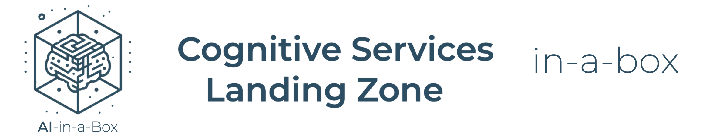

# Cognitive Services Landing Zone in-a-box


## Solution Architecture

The solution architecture is described in the diagram below.


## Pre-requisites

- Install Azure CLI
- Log into your Azure subscription

```
az login
```

## Deploy to Azure

```
az deployment sub create -f main.bicep --parameters main.bicepparam
```
If this step causes you any errors, try updating your Azure CLI.