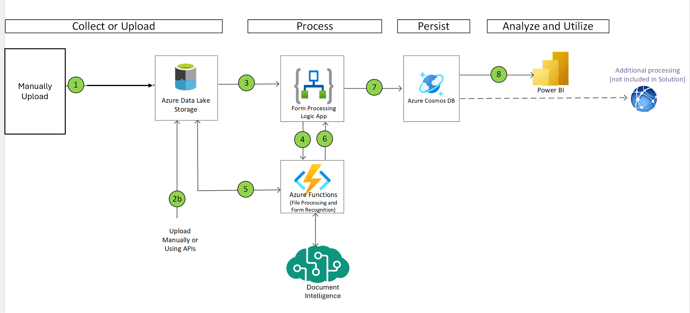

# Doc-Intelligence-in-a-Box

## Use Case
This solution accelerator empowers companies to automate the processing of PDF forms to modernize their operations, save time, and reduce cost.

The solution leverages [Azure AI Document Intelligence](https://azure.microsoft.com/en-us/products/ai-services/ai-document-intelligence) to extract data from PDF forms and store the data in a [Azure Cosmos DB](https://learn.microsoft.com/en-us/azure/cosmos-db/introduction).

## Solution Architecture
The below architecture diagram illustrates the main components and information flow of this solution accelerator: 

1. PDF forms are uploaded to a container in [Azure Data Lake Storage Gen2](https://learn.microsoft.com/en-us/azure/storage/blobs/data-lake-storage-introduction) (ADLS Gen2).
1. When PDF forms are uploaded to the container, an [Azure Logic App](https://learn.microsoft.com/en-us/azure/logic-apps/logic-apps-overview) is triggered to start the processing of the PDF form(s).  
1. The Logic App sends the PDF file location to an [Azure Functions app](https://learn.microsoft.com/en-us/azure/azure-functions/functions-overview?pivots=programming-language-python) for processing.
1. The Azure Functions app receives the location of file and performs the following:

    1. Splits the file into single pages if the file has multiple pages, with each page containing one independent form and saves them to an Azure Data Lake Storage Gen2.
    1. Sends the location of the single page PDF file to Azure Document Intelligence for processing via a REST API (HTTPS POST)and receives response.
    1. Prepares the response into the desired data structure.
    1. Saves the structured data as a JSON file to another Azure Data Lake Storage Gen2 container.

1. The Logic App receives the processed response data from the Azure Functions app and sends the processed data to Azure Cosmos DB.
1. Azure Cosmos DB saves the data into specified database and collections.
1. [Power BI](https://learn.microsoft.com/en-us/power-bi/fundamentals/power-bi-overview) is connected to the Azure Cosmos DB to extract data and provide insights.

## Prerequisites

* An [Azure subscription](https://azure.microsoft.com/en-us/free/).
* Install latest version of [Azure CLI](https://docs.microsoft.com/en-us/cli/azure/install-azure-cli-windows?view=azure-cli-latest)
* Install latest version of [Bicep](https://docs.microsoft.com/en-us/azure/azure-resource-manager/bicep/install)
* Install latest version [Azure Functions Core Tools](https://docs.microsoft.com/en-us/azure/azure-functions/functions-run-local?tabs=v4%2Cwindows%2Ccsharp%2Cportal%2Cbash#v2)
* If you wish to connect Power BI see the a report over data processed using Azure AI Document Intelligence, install [Power BI Desktop](https://powerbi.microsoft.com/en-us/desktop/).
* Clone this repo

## Document Intelligence Accelerator Deployment Guide

Follow the steps below to set up your Azure resources, create the Document Intelligence model, test the solution, and visualize the results in Power BI.

### Step 1: Deploy the Solution Accelerator

Follow instructions in the folder `1_infra`: [Deployment Scripts Guide](./1_infra/README.md).

### Step 2: Create Azure AI Document Intelligence Machine Learning Model

Follow instructions in the folder `2_machine_learning_model` : [Machine Learning Model Guide](./2_machine_learning_model/README.md).

### Step 3: Test the Solution Accelerator

Follow instructions in the `4_solution_testing` folder: [Solution Testing Guide](./3_solution_testing/README.md).

### Step 4: Set Up Power BI Model

Follow instructions in the `5_power_bi` folder: [PowerBI Model Guide](./4_power_bi/README.md).
