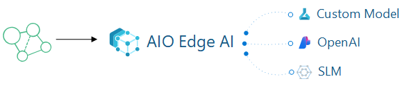

# AIO with AI in-a-box

## Background
The "AIO with AI in-a-box" project is a comprehensive toolkit designed to help users deploy AI and machine learning solutions at the edge efficiently especially in combination with [Azure IoT Operations](https://learn.microsoft.com/en-us/azure/iot-operations/) - AIO. The "AIO with AI in-a-box" includes a modular framework that enables the integration and management of AI models on edge devices (hybride) with AIO, bridging the gap between cloud-based AI models and local OT systems. With a focus on low-latency environments, this allows developers to build and deploy machine learning models directly to hybride edge devices with AIO. This makes it highly relevant for industries looking to integrate AI on the shopfloor, offering scalable, adaptable, and secure AI capabilities in distributed environments.

This accelerator contains a minimal AIO (Azure IoT Operations/Kubernetes) configuration that enables:

* Azure ML to AIO - Orchestration of resources for the entire Edge AI model lifecycle with AIO (Azure IoT Operations enabled by ARC), including creation, deployment, and proper packaging through Azure ML, AIO and ARC. This involves leveraging key components such as AIO, Arc-Enabled Kubernetes cluster, Azure ARC, Azure ML and Azure ML CLI V2 notebooks.

* AIO with Azure Open AI - Deployment and enablement of Cerebral to demonstrate how to leverage Azure OpenAI and Natural Language Processing (NLP) within an AIO environment.

* AIO with SLMs (RAG) on Edge Deployment and Enablement of Small Language Models (SLMs) at the Edge within an AIO environment. This setup integrates SLMs to enable Retrieval-Augmented Generation (RAG) at the edge, optimizing performance and reducing reliance on cloud resources for a more efficient and responsive AIO deployment.

### Why with Microsoft Azure IoT Operations?

[Microsoft Azure IoT Operations](https://learn.microsoft.com/en-us/azure/iot-operations/)  is ideal for manufacturing because it provides local processing power with (hybride) edge computing capabilities, enabling data processing for faster decision-making on the factory floor. It supports key industrial standards like OPC UA and MQTT, ensuring seamless integration with a wide range of manufacturing equipment and systems. The platform’s scalability makes it suitable for businesses of any size, whether managing a single facility or a global network of factories. By leveraging artificial intelligence and machine learning, Azure IoT allows manufacturers to gain deeper insights into production trends, enabling advanced analytics and proactive quality management.

### Use cases for this solution
Here are some example use cases that can be achieved with this solution.

#### Quality control
 The solution enhances quality control in manufacturing by enabling monitoring of production parameters using sensor data or camera technolgoy. With advanced AI and machine learning models trained in Microoft Azure, this solution can detect anomalies, such as defects or deviations from quality standards, early in the production process. This proactive approach reduces the risk of defective products reaching customers, thereby minimizing waste and rework.

#### Energy Management
It can enables manufacturers to implement effective energy management strategies by providing monitoring of energy consumption across production lines and facilities. Through advanced analytics, it can identifies energy inefficiencies, enabling the implementation of corrective actions that reduce waste and optimize energy use. These insights not only lower operational costs but also support ESG (Environmental, Social, and Governance) initiatives by helping manufacturers minimize their carbon footprint.

#### Faster insights with Factory Copilot
The factory copilot on the Edge can leverages data processing in the factory, providing operators and managers with actionable insights, alerts, and recommendations through a centralized dashboard. This digital assistant can proactively suggest process optimizations, highlight potential issues, and guide operators through complex tasks. With AI-driven analytics and natural language interfaces, the copilot improves situational awareness and empowers factory personnel to make data-driven decisions quickly. This synergy results in smoother operations, reduced downtime, and enhanced productivity across the production line.

### High level Architecture
Below you will find the global architecture of this accelator. The main solution is based on a virtual machine with Ubuntu, running K3s. Off course you are also able to deploy this solution to a dedicated (hybride)Edge device where you can run the ML model near your machines.

 

The Architecture has the following steps:

1. You create all your necessary Azure Resources: 
* K3s Cluster, Azure ML Workspace, Container Registry, Storage, Edge VM (for testing), and Azure ML Extension
2. Within Azure ML Studio you start creating/working your model:
* Connect to Azure Machine Learning Workspace
* Grab your Training Data and create your JSONL and MLTable(s)
* Create your Compute so you can train your data
* Configure and run the AutoML training job
* Convert model to appropriate format (Onnx) if necessary
* Using MFLow Retrieve the Best Trial (Best Model's trial/run)
* Register best Model and Deploy
* Test: Visualize Model Results
3. Once you have your model you deploy it to your AIO K3s Cluster
* You will build your model into a docker image and place that image in your container registry
* Using Azure ML Extension you will leverage the Azure ML Extension to pull the appropriate model from ACR into your K3s Cluster

### Demo
TODO

## Getting started
The following steps are needed to install this solution:

1. [Deploy the solution](./deployment.md) to Microsoft Azure
2. [Post deployment ](./postdeployment.md)
3. [Run and test the solution](./runsolution.md)

## Support

We are always looking for feedback on our current experiences and what we should work on next. If there is anything you would like us to prioritize, please feel free to suggest so via our GitHub Issue Tracker. You can submit a bug report, a feature suggestion or participate in discussions.

### Contributing
This project welcomes contributions and suggestions. Most contributions require you to agree to a Contributor License Agreement (CLA) declaring that you have the right to, and actually do, grant us the rights to use your contribution. For details, visit https://cla.opensource.microsoft.com.

### Disclaimer
The lifecycle management (health, kubernetes version upgrades, security updates to nodes, scaling, etc.) of the AKS or Arc enabled Kubernetes cluster is the responsibility of the customer.

For AKS, read what is managed and what is shared responsibility here

All preview features are available on a self-service, opt-in basis and are subject to breaking design and API changes. Previews are provided "as is" and "as available," and they're excluded from the service-level agreements and limited warranty.

### Key Contacts & Contributors

Highlight the main contacts for the project and acknowledge contributors. You can adapt the structure from AI-in-a-Box:

| Contact            | GitHub ID           | Email                    |
|--------------------|---------------------|--------------------------|
| Andrés Padilla | @AndresPad | anpadill@microsoft.com |
| Victor Santana | @Welasco | vsantana@microsoft.com |
| Chris Ayers | @codebytes | chrisayers@microsoft.com |
| Neeraj Jhaveri | @neerajjhaveri | nejhaver@microsoft.com |
| Nabeel Muhammad | @nabeelmsft | munabeel@microsoft.com |
| Ali Sanjabi | @asanjabi | alsanjab@microsoft.com |
| João Carlos Santos | @jomacedo | jomacedo@microsoft.com |
| Georgina Siggins | @georgesiggins | gsiggins@microsoft.com |
| Remco Ploeg | @rploeg | remcoploeg@microsoft.com |
| Armando Blanco Garcia | @armandoblanco | armbla@microsoft.com |
| Cheng Chen | @ChenCheng368 | chencheng@microsoft.com |

### License

This project may contain trademarks or logos for projects, products, or services. Authorized use of Microsoft trademarks or logos is subject to and must follow [Microsoft's Trademark & Brand Guidelines](https://www.microsoft.com/en-us/legal/intellectualproperty/trademarks/usage/general). Use of Microsoft trademarks or logos in modified versions of this project must not cause confusion or imply Microsoft sponsorship. Any use of third-party trademarks or logos are subject to those third-party's policies.