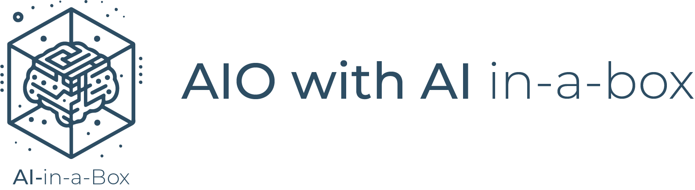

# AIO with AI in-a-box


## Use Case
Orchestration of resources for the entire Edge AI model lifecycle with AIO (Azure IoT Operations enabled by ARC), including creation, deployment, and proper packaging through Azure ML, AIO and ARC . This involves leveraging key components such as AIO, AKS, ARC, Azure ML and Azure ML CLI V2.

## Solution Architecture
 

### The above architecture is explained step-by-step below:
1. You create all your necessary Azure Resources
    * (K3s Cluster, Azure ML Workspace, Container Registry, Storage, Edge VM (for testing), and Azure ML Extension)
1. Within Azure ML Studio you start creating/working your model:
    1. Connect to Azure Machine Learning Workspace
    2. Grab your Training Data and create your JSONL and MLTable(s)
    3. Create your Compute so you can train your data
    4. Configure and run the AutoML training job
    5. Convert model to appropriate format (Onnx) if necessary
    6. Using MFLow Retrieve the Best Trial (Best Model's trial/run)
    7. Register best Model and Deploy
    8. Test: Visualize Model Results
1. Once you have your model you deploy it to your AIO K3s Cluster
    1. You will build your model into a docker image and place that image in your container registry
    1. Using Azure ML Extension you will leverage the Azure ML Extension to pull the appropriate model from ACR into your K3s Cluster

 

### Resources that will be deployed:
 

## Prerequisites
* An [Azure subscription](https://azure.microsoft.com/en-us/free/).
* Install latest version of [Azure CLI](https://docs.microsoft.com/en-us/cli/azure/install-azure-cli-windows?view=azure-cli-latest)
* Install [Azure Developer CLI](https://learn.microsoft.com/en-us/azure/developer/azure-developer-cli/install-azd)
* Enable the Following [Resource Providers](https://learn.microsoft.com/en-us/azure/azure-resource-manager/management/resource-providers-and-types) on your Subscription:
    - Microsoft.AlertsManagement
    - Microsoft.Compute
    - Microsoft.ContainerInstance
    - Microsoft.ContainerService
    - Microsoft.DeviceRegistry
    - Microsoft.ExtendedLocation
    - Microsoft.IoTOperationsDataProcessor
    - Microsoft.IoTOperationsMQ
    - Microsoft.IoTOperationsOrchestrator
    - Microsoft.KeyVault
    - Microsoft.Kubernetes
    - Microsoft.KubernetesConfiguration
    - Microsoft.ManagedIdentity
    - Microsoft.Network

* Install the following [Azure CLI Extensions](https://learn.microsoft.com/en-us/cli/azure/azure-cli-extensions-list): 
    * az extension add -n [azure-iot-ops](https://github.com/azure/azure-iot-ops-cli-extension) --allow-preview true 
    * az extension add -n [connectedk8s](https://github.com/Azure/azure-cli-extensions/tree/main/src/connectedk8s) 
    * az extension add -n [k8s-configuration](https://github.com/Azure/azure-cli-extensions/tree/master/src/k8sconfiguration) 
    * az extension add -n [k8s-extension](https://github.com/Azure/azure-cli-extensions/tree/main/src/k8s-extension) 
    * az extension add -n [ml](https://github.com/Azure/azureml-examples)

* Install latest version of [Bicep](https://docs.microsoft.com/en-us/azure/azure-resource-manager/bicep/install)
* Prepare your Linux virtual machine or physical device for [IoT Edge](https://learn.microsoft.com/en-us/azure/iot-edge/how-to-provision-single-device-linux-symmetric)

## Deployment Flow 

**Step 1.** Clone the [Edge-AIO-in-a-Box Repository](https://github.com/Azure-Samples/edge-aio-in-a-box)

**Step 2.** Create Azure Resources (User Assigned Managed Identity, VNET, Key Vault, Ubuntu VM, Azure ML Workspace, Container Registry)

**Step 2.** Configure Ubuntu VM

**Step 3.** Buld ML model into docker image

**Step 4.** Push model to Azure Container Registry

**Step 5.** Deploy model to the Edge via Azure IoT Operations

## Deploy to Azure

1. Log into your Azure subscription: 
    ```
    azd auth login --tenant-id xxxxxxxx-xxxx-xxxx-xxxx-xxxxxxxx
    ```

1. Clone this repository locally: 

    ```
    git clone https://github.com/Azure-Samples/edge-aio-in-a-box
    cd edge-ai/AIO-with-AI
    ```

2. Deploy resources:
    ```
    azd up
    ```

    You will be prompted for a subcription, region and additional parameters.


## Post Deployment
Once your resources have been deployed you will need to do the following to get the notebooks up running in Azure ML Studio and your Edge Pod functioning properly:

* When running the notebooks in AML your user (jim@contoso.com for instance) won't have permission to alter the storage account or add data to the storage. Please ensure that you have been assigned both **Storage Blob Data Reader** and **Storage Blob Data Contributor** roles.

* Run the Notebook(s) 
    * 1-AutoML-ObjectDetection.ipynb

## Deployment Issues
 - export OBJECT_ID = $(az ad sp show --id bc313c14-388c-4e7d-a58e-70017303ee3b --query id -o tsv)
 - You need to make sure that you get this value from a tenant that you have access to get to the graph api in the tenant. 
 - https://learn.microsoft.com/en-us/azure/azure-arc/kubernetes/custom-locations
 - https://learn.microsoft.com/en-us/cli/azure/ad/sp?view=azure-cli-latest

## How to Contribute

This project welcomes contributions and suggestions. Most contributions require you to agree to a Contributor License Agreement (CLA) declaring that you have the right to, and actually do, grant us the rights to use your contribution. For details, visit <https://cla.opensource.microsoft.com>

When you submit a pull request, a CLA bot will automatically determine whether you need to provide a CLA and decorate the PR appropriately (e.g., status check, comment). Simply follow the instructions provided by the bot. You will only need to do this once across all repos using our CLA.

This project has adopted the [Microsoft Open Source Code of Conduct](https://opensource.microsoft.com/codeofconduct/). For more information see the [Code of Conduct FAQ](https://opensource.microsoft.com/codeofconduct/faq) or contact <opencode@microsoft.com> with any additional questions or comments.

## Key Contacts & Contributors

Highlight the main contacts for the project and acknowledge contributors. You can adapt the structure from AI-in-a-Box:

| Contact            | GitHub ID           | Email                    |
|--------------------|---------------------|--------------------------|
| Andrés Padilla | @AndresPad | anpadill@microsoft.com |
| Victor Santana | @Welasco | vsantana@microsoft.com |
| Chris Ayers | @codebytes | chrisayers@microsoft.com |
| Neeraj Jhaveri | @neerajjhaveri | nejhaver@microsoft.com |
| Nabeel Muhammad | @nabeelmsft | munabeel@microsoft.com |
| Ali Sanjabi | @asanjabi | alsanjab@microsoft.com |
| João Carlos Santos | @jomacedo | jomacedo@microsoft.com |
| Georgina Siggins | @georgesiggins | gsiggins@microsoft.com |
| Remco Ploeg | @rploeg | remcoploeg@microsoft.com |
| Armando Blanco Garcia | @armandoblanco | armbla@microsoft.com |
| Cheng Chen | @ChenCheng368 | chencheng@microsoft.com |


## License

This project may contain trademarks or logos for projects, products, or services. Authorized use of Microsoft trademarks or logos is subject to and must follow [Microsoft's Trademark & Brand Guidelines](https://www.microsoft.com/en-us/legal/intellectualproperty/trademarks/usage/general). Use of Microsoft trademarks or logos in modified versions of this project must not cause confusion or imply Microsoft sponsorship. Any use of third-party trademarks or logos are subject to those third-party's policies.