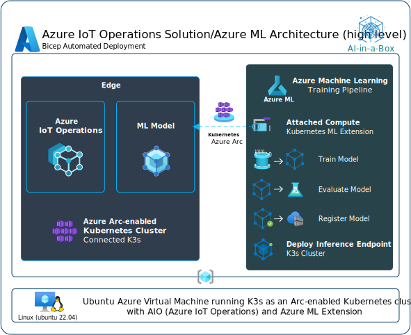

# AIO with AI in-a-box


## Use Case
Orchestration of resources for the entire Edge AI model lifecycle with AIO (Azure IoT Operations enabled by ARC), including creation, deployment, and proper packaging through Azure ML, AIO and ARC . This involves leveraging key components such as AIO, AKS, ARC, Azure ML and Azure ML CLI V2.

## Solution Architecture


### The above architecture is explained step-by-step below:
1. You create all your necessary Azure Resources
    * (IoT Hub, Azure ML Workspace, Container Registry, Azure Cognitive Services for Vision (if applicable), Storage, Edge VM (for testing), and register your IoT Edge Devices)
1. Within Azure ML Studio you start creating/working your model:
    1. Connect to Azure Machine Learning Workspace
    2. Grab your Training Data and create your JSONL and MLTable(s)
    3. Create your Compute so you can train your data
    4. Configure and run the AutoML training job
    5. Convert model to appropriate format (Onnx) if necessary
    6. Using MFLow Retrieve the Best Trial (Best Model's trial/run)
    7. Register best Model and Deploy
    8. Test: Visualize Model Results
1. Once you have your model you deploy it to your Edge Device
    1. You will build your model into a docker image and place that image in your container registry
    1. Using IoT Edge you will leverage a deployment manifest as the instructions to pull the appropriate model from ACR into your IoT Edge Device


## Prerequisites
* An [Azure subscription](https://azure.microsoft.com/en-us/free/).
* Install latest version of [Azure CLI](https://docs.microsoft.com/en-us/cli/azure/install-azure-cli-windows?view=azure-cli-latest)
* Install [Azure Developer CLI](https://learn.microsoft.com/en-us/azure/developer/azure-developer-cli/install-azd)
* Install [Azure IoT Extension](https://github.com/Azure/azure-iot-cli-extension) for Azure CLI
    * az extension add --name azure-cli-iot-ext
* Install latest version of [Bicep](https://docs.microsoft.com/en-us/azure/azure-resource-manager/bicep/install)
* Prepare your Linux virtual machine or physical device for [IoT Edge](https://learn.microsoft.com/en-us/azure/iot-edge/how-to-provision-single-device-linux-symmetric)

## Deployment Flow 


**Step 1.** Clone the [AI-in-a-Box repository](https://github.com/Azure/AI-in-a-Box)

**Step 2.** Create Azure Resources (User Assigned Managed Identity, VNET, Key Vault, Ubuntu VM, Azure ML Workspace, Container Registry)

**Step 2.** Configure Ubuntu VM

**Step 3.** Buld ML model into docker image

**Step 4.** Push model to Azure Container Registry

**Step 5.** Deploy model to the Edge via Azure IoT Operations

## Deploy to Azure

1. Log into your Azure subscription: 
    ```
    azd auth login --tenant-id xxxxxxxx-xxxx-xxxx-xxxx-xxxxxxxx
    ```

1. Clone this repository locally: 

    ```
    git clone https://github.com/Azure/AI-in-a-Box
    cd edge-ai/AIO-with-AI
    ```

2. Deploy resources:
    ```
    azd up
    ```

    You will be prompted for a subcription, region and additional parameters.


## Post Deployment
Once your resources have been deployed you will need to do the following to get the notebooks up running in Azure ML Studio and your Edge Pod functioning properly:

* When running the notebooks in AML your user (jim@contoso.com for instance) won't have permission to alter the storage account or add data to the storage. Please ensure that you have been assigned both **Storage Blob Data Reader** and **Storage Blob Data Contributor** roles.

* Run the Notebook(s) 
    * 1-AutoML-ObjectDetection.ipynb

## Deployment Issues
 - export OBJECT_ID = $(az ad sp show --id bc313c14-388c-4e7d-a58e-70017303ee3b --query id -o tsv)
 - You need to make sure that you get this value from a tenant that you have access to get to the graph api in the tenant. 
 - https://learn.microsoft.com/en-us/azure/azure-arc/kubernetes/custom-locations
 - https://learn.microsoft.com/en-us/cli/azure/ad/sp?view=azure-cli-latest