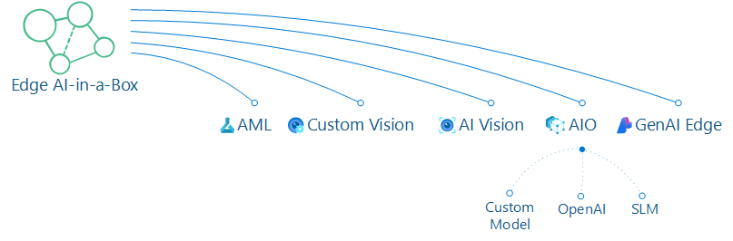

# EdgeAI in-a-box

## Why Edge AI?

Edge AI excels in diverse applications like image classification, object detection, body, face, and gesture analysis, as well as image manipulation. Moreover, in this swiftly evolving Generative AI (Gen AI) landscape, the move from cloud-based Gen AI to Edge Gen AI is becoming more prominent. This shift is not just desirable but increasingly necessary, propelled by demands for privacy, security, hyper-personalization, accuracy, cost-effectiveness, energy efficiency, and more. While the commercialization of today's cloud-based Gen AI is in full swing, there are efforts underway to optimize models to run on power-sipping edge devices with efficient mobile GPUs, Neural and Tensor processors (NPU and TPU).

With this in mind, we aim to simplify your understanding of creating a model, packaging it, and deploying it to the edge. The series kicks off by establishing the baseline of creating and deploying a model with Azure ML and IoT Edge. We'll then explore more specific scenarios, such as deploying a model with AKS and AKS Edge, dive into creating a model with ONNX Runtime, and finally guide you into the realm of Edge Gen AI. Our ultimate goal is to provide you with a clearer understanding of your options within Azure for Edge AI scenarios.

## Why does AI-in-a-Box have an Edge AI Section?

### Because we want to show you the options of crafting and deploying a model anywhere

**Edge AI** plays a crucial role in expanding AI and ML capabilities by bringing them directly to edge devices. This emphasizes the importance of running AI models on these devices and underscores the essential interplay between various Azure services. This series introduces a progressive flow designed to enhance your comprehension of model creation and deployment on Edge devices or Edge-compatible containers. It guides you through the journey, starting with fundamental concepts, advancing towards AKS deployments, and eventually delving into more advanced GenAI Edge scenarios. These practical examples aim to deepen your understanding of the possibilities within Azure for Edge AI scenarios, providing valuable insights into the diverse applications of this technology.

The series will encompass:

1. [AML Edge](https://github.com/Azure-Samples/aml-edge-in-a-box) - Creating a model in Azure ML, leveraging AutoML, packaging it correctly and deploying with IoT Edge to an Edge Device.
2. [Custom Vision Edge](https://github.com/Azure-Samples/customvision-edge-in-a-box) - Creating a model with Azure's [Custom Vision](https://learn.microsoft.com/en-us/azure/ai-services/custom-vision-service/overview) and deploying with IoT Edge and running that AI model in a docker container.

3. [AI Vision](https://learn.microsoft.com/en-us/azure/ai-services/computer-vision/overview) - Azure AI services provides several Docker containers that let you use the same APIs that are available in Azure, on-premises. Using these containers gives you the flexibility to bring Azure AI services closer to your data for compliance, security or other operational reasons. 
    - Optical Character Recognition (OCR) - The Read OCR container allows you to extract printed and handwritten text from images and documents with support for JPEG, PNG, BMP, PDF, and TIFF file formats. For more information, see the [Read API documentation](https://learn.microsoft.com/en-us/azure/ai-services/computer-vision/overview-ocr). This container can also [run in disconnected environments](https://learn.microsoft.com/en-us/azure/ai-services/containers/disconnected-containers).

We are actively advancing this series to showcase the creation and deployment of models within Azure-Arc enabled Kubernetes and [Azure IoT Operations](https://learn.microsoft.com/en-us/azure/iot-operations/get-started/overview-iot-operations) scenarios.

4. [Azure IoT Operations (AIO)](https://aka.ms/aio-edgeai):
    - **Azure ML to AIO** - Creating a model and deploying that model in Azure-Arc enabled Kubernetes and [Azure IoT Operations](https://learn.microsoft.com/en-us/azure/iot-operations/get-started/overview-iot-operations) scenarios with the [Azure ML Extension](https://learn.microsoft.com/en-us/azure/machine-learning/how-to-attach-kubernetes-anywhere?view=azureml-api-2).
    - **AIO with Open AI** - Using ***[Cerebral](https://github.com/Azure/arc_jumpstart_drops/tree/main/sample_app/cerebral_genai)***, we will demonstrate how to seamlessly integrate Azure OpenAI and Natural Language Processing (NLP) into an AIO deployment. This setup will highlight how to implement Retrieval-Augmented Generation (RAG) for efficient document retrieval and actionable insights. By optimizing the use of local AIO resources alongside Azure OpenAI, this enhancement delivers faster, more contextually aware responses directly from the network edge.
    - **AIO with SLMs (RAG) on Edge** - We will demonstrate how to optimize your [AIO](https://learn.microsoft.com/en-us/azure/iot-operations/get-started/overview-iot-operations)/***[Cerebral](https://github.com/Azure/arc_jumpstart_drops/tree/main/sample_app/cerebral_genai)*** setup by integrating Small Language Models (SLMs) from various model catalogs for flexible edge deployments, enabling Retrieval-Augmented Generation (RAG) at the Edge. By localizing key GenAI processing tasks, this approach reduces dependence on cloud resources, allowing RAG to function seamlessly in disconnected/hybrid environments. 
    
Additionally, we plan to expand the series by offering valuable knowledge and key building blocks to help you navigate GenAI scenarios at the edge. This includes practical insights into integrating ChatGPT with Azure AI Vision, performing video analysis using Azure Video Indexer, and leveraging GPT-4 Turbo with Vision, GPT-4o, or Phi-3 Vision for tasks such as OCR, object detection, video insights, and image analysis.

5. [GenAI Edge]() - Working with GenAI at the edge scenarios -> Work in Progress.

Stay tuned for more exciting accelerators in the pipeline, as there's much more to come!

## Quick Note: Model customization in Azure Custom Vision and/or Azure AI Services

You can train a custom model using either the [Custom Vision](https://learn.microsoft.com/en-us/azure/ai-services/custom-vision-service/overview) service or the Image Analysis 4.0 service (within [Azure AI Services](https://learn.microsoft.com/en-us/azure/ai-services/computer-vision/overview)) with model customization. The [following table](https://learn.microsoft.com/en-us/azure/ai-services/computer-vision/concept-model-customization) compares the two services.

|Areas|Custom Vision service|Image Analysis 4.0 service|
|---|---|---|
|Tasks | Image classification Object detection | Image classification   Object detection |
|Base model | CNN |	Transformer model |
|Labeling |	[CustomVision.ai](https://www.customvision.ai/) | [AML Studio](https://ml.azure.com/) |
|Web Portal | [CustomVision.ai](https://www.customvision.ai/) | [Vision Studio](http://aka.ms/VisionStudio) |
|Libraries | REST, SDK | REST, Python Sample |
|Minimum training data needed |	15 images per category |2-5 images per category |
|Training data storage | Uploaded to service | Customer’s blob storage account |
|Model hosting | Cloud and **Edge** | Cloud hosting only, ***Edge container hosting to come*** |

## Additional Resources

### Check out our Mindmap

[ ML/AI Edge MindMap](https://aka.ms/mledge-mm)
