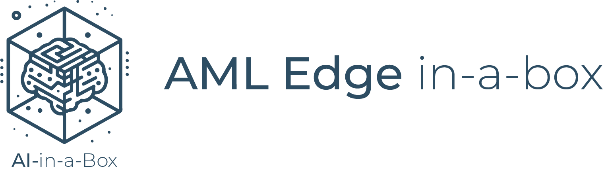

# EdgeAI in-a-box


## Use Case
Orchestration of resources for the entire Edge AI model lifecycle, including creation, deployment, and proper packaging through Azure ML and IoT Edge. This involves leveraging key components such as IoT Hub, IoT Edge, Azure ML, and Azure ML CLI V2.

## Solution Architecture


### The above architecture is explained step-by-step below:
1. You create all your necessary Azure Resources
    * (IoT Hub, Azure ML Workspace, Container Registry, Azure Cognitive Services for Vision (if applicable), Storage, Edge VM (for testing), and register your IoT Edge Devices)
1. Within Azure ML Studio you start creating/working your model:
    1. Connect to Azure Machine Learning Workspace
    2. Grab your Training Data and create your JSONL and MLTable(s)
    3. Create your Compute so you can train your data
    4. Configure and run the AutoML training job
    5. Convert model to appropriate format: ONNX, OpenVino
    6. Using MFLow Retrieve the Best Trial (Best Model's trial/run)
    7. Register best Model and Deploy
    8. Test: Visualize Model Results
1. Once you have your model you deploy it to your Edge Device
    1. You will build your model into a docker image and place that image in your container registry
    1. Using IoT Edge you will leverage a deployment manifest as the instructions to pull the appropriate model from ACR into your IoT Edge Device


## Prerequisites
* An [Azure subscription](https://azure.microsoft.com/en-us/free/).
* Install latest version of [Azure CLI](https://docs.microsoft.com/en-us/cli/azure/install-azure-cli-windows?view=azure-cli-latest)
* Install [Azure Developer CLI](https://learn.microsoft.com/en-us/azure/developer/azure-developer-cli/install-azd)
* Install [Azure IoT Extension](https://github.com/Azure/azure-iot-cli-extension) for Azure CLI
    * az extension add --name azure-cli-iot-ext
* Install latest version of [Bicep](https://docs.microsoft.com/en-us/azure/azure-resource-manager/bicep/install)
* Prepare your Linux virtual machine or physical device for [IoT Edge](https://learn.microsoft.com/en-us/azure/iot-edge/how-to-provision-single-device-linux-symmetric)

## Deployment Flow 


**Step 1.** Clone the [AI-in-a-Box repository](https://github.com/Azure/AI-in-a-Box)

**Step 2.** Create Azure Resources (User Assigned Managed Identity, IoT Hub, Azure ML Workspace, Container Registry, IoT Edge Devices, IoT Edge VM)

**Step 2.** Configure Edge Device and Create Edge VM if you would like

**Step 3.** Buld ML model into docker image

**Step 4.** Deploy ML model on IoT Edge

**Step 5.** Test ML Module

## Deploy to Azure

1. Log into your Azure subscription: 
    ```
    azd auth login
    ```

1. Clone this repository locally: 

    ```
    git clone https://github.com/Azure/AI-in-a-Box
    cd edge-ai/aml-edge-in-a-box
    ```

2. Deploy resources:
    ```
    azd up
    ```

    You will be prompted for a subcription, and region.


## Post Deployment
Once your resources have been deployed you will need to do the following to get the notebooks up running and your Edge VM or device functioning properly:

* When running the notebooks your user won't have permission to alter the storage account. Please ensure that you have been assigned both **Storage Blob Data Reader** and ****Storage Blob Data Contributor** roles.

* Once the VM is deployed or your physical device is setup you can ssh into the VM/device using the below command   
    * ssh NodeVMAdmin@edgevm1.eastus.cloudapp.azure.com -p 2222 
* Once connected to your virtual machine, [verify](https://learn.microsoft.com/en-us/azure/iot-edge/quickstart-linux) that the runtime was successfully installed and configured on your IoT Edge device.
    * sudo iotedge system status
    * sudo iotedge list
    * sudo iotedge check

* Once you get access to your VM you will need to deploy your Model through a Deployment Manifest.