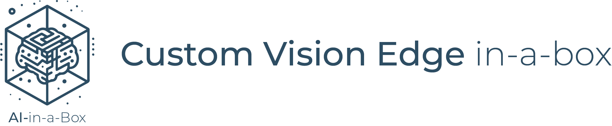
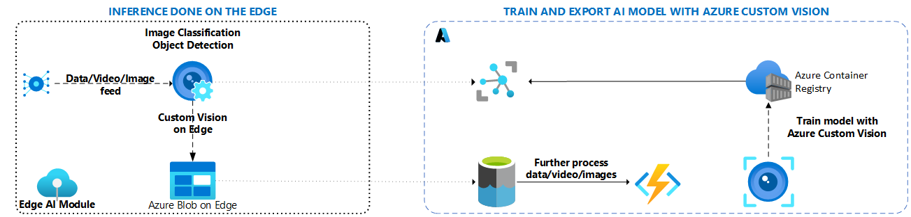
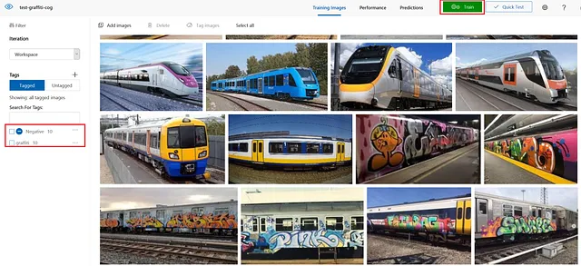

# Custom Vision Edge in-a-box


## Use Case

In real-time decision scenarios with cloud latency challenges, Edge AI enables us to shift analysis closer to the data source, extracting responsive results. These advantages are exemplified in the architecture below. In this accelerator, we aim to demonstrate how easy it is to leverage [Custom Vision](https://www.customvision.ai/)  for training a classification model and exporting it to a specific format, such as ONNX or a Dockerfile, ready for deployment to an edge container.

The sample includes deploying the necessary infrastructure and guides you through the model creation and export process within [Custom Vision Studio](https://www.customvision.ai/).

## Solution Architecture


### The above architecture is explained step-by-step below:
1. You create all your necessary Azure Resources
    * (IoT Hub, Container Registry, Azure Custom Vision Account, Storage, Edge VM (for testing), and register your IoT Edge Devices)
1. Within [Custom Vision Studio](https://www.customvision.ai/) you start creating/working your model:
    * Create and export AI model
        * Train Custom Vision model to detect graffiti on trains.
        * Export Custom Vision model as docker file
        * Deploy AI model as container on edge device
            * Deploy model via a deployment manifest
2. Detection is done to the edge using Custom Vision model
3. If graffiti is detected, the video is added to Azure Storage account using Blob on Edge
4. Video is synced up to Azure for further analysis and possibly OCR (Optical Character Recognition)

## Prerequisites
* An [Azure subscription](https://azure.microsoft.com/en-us/free/).
* Install latest version of [Azure CLI](https://docs.microsoft.com/en-us/cli/azure/install-azure-cli-windows?view=azure-cli-latest)
* Install [Azure Developer CLI](https://learn.microsoft.com/en-us/azure/developer/azure-developer-cli/install-azd)
* Install [Azure IoT Extension](https://github.com/Azure/azure-iot-cli-extension) for Azure CLI
    * az extension add --name azure-cli-iot-ext
* Install latest version of [Bicep](https://docs.microsoft.com/en-us/azure/azure-resource-manager/bicep/install)
* Prepare your Linux virtual machine or physical device for [IoT Edge](https://learn.microsoft.com/en-us/azure/iot-edge/how-to-provision-single-device-linux-symmetric)

## Deployment Flow 
(Leverage the following article for reference as you deploy the solution: [How to deploy your AI model on Edge devices with Azure](https://towardsdatascience.com/how-to-deploy-your-ai-model-on-edge-devices-8c38a9519c58))

**Step 1.** Clone the [AI-in-a-Box repository](https://github.com/Azure/AI-in-a-Box)

**Step 2.** Create Azure Resources (User Assigned Managed Identity, IoT Hub, Custom Vision Account, Container Registry, IoT Edge Devices, and if you would like an IoT Edge VM)

**Step 2.** Configure Edge Device and Create Edge VM if you would like

**Step 3.** Build ML model into docker image using [Custom Vision Studio](https://www.customvision.ai/)
* Create a Custom Vision project with properties “classification” and multiclass (Single tag per image)”
    
* Make sure you select General (compact) as domain, otherwise the model cannot be exported as a container
* Upload the images from the /trainingimages folder into your project
* Tag your images
    * First step, add the graffiti pictures with tag graffiti to your project
    * Second step, add the no graffiti pictures with tag graffiti but select NEGATIVE to your project.
    

    * Third step, click on green button and train your model.
* Export 
    * Export Custom Vision model as docker file
    * Once you trained and tested the model, you can either create an endpoint of your model or export it. In this scenario, the model is exported as dockerfile. Go to your project, select the iteration you want to export and then select export. Subsequently, select to export the model as dockerfile which contains a TensorFlow .pb file.
    

**Step 4.** Push model to Azure Container Registry if you would like

**Step 5.** Deploy model onto Edge Device via a [Deployment Manifest](https://learn.microsoft.com/en-us/azure/iot-edge/module-composition) build & deploy process. Please visit how to [Develop IoT Edge Modules using VS Code](https://learn.microsoft.com/en-us/azure/iot-edge/tutorial-develop-for-linux?view=iotedge-1.4&tabs=csharp&pivots=iotedge-dev-cli)

## Deploy to Azure

1. Log into your Azure subscription: 
    ```
    azd auth login
    ```

1. Clone this repository locally: 

    ```
    git clone https://github.com/Azure/AI-in-a-Box
    cd edge-ai/customvision-edge-in-a-box
    ```

2. Deploy resources:
    ```
    azd up
    ```

    You will be prompted for a subscription, region and additional parameters.


## Post Deployment
(Note: To fully deploy the entire architecture mentioned above, you'll need to adapt the deployment process to include the deployment manifest step, the creation of the function app, and the Azure Blob on Edge IoT Edge Module.)