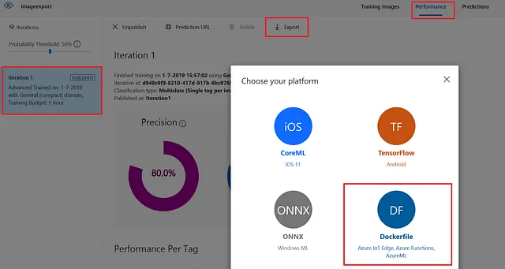

# Custom Vision Edge in-a-box


## Use Case
In situations requiring real-time decisions and facing latency issues with cloud computing, Edge AI analyzes videos directly on the edge for prompt responsiveness. It ensures uninterrupted device functionality offline, crucial for limited cloud connectivity, and optimizes bandwidth by processing data locally.

The technology is demonstrated in this sample which focuses on graffiti detection on trains using Azure IoT Edge and [Custom Vision AI](https://learn.microsoft.com/en-us/azure/ai-services/custom-vision-service/overview). The process involves cloud training, exporting, and deploying a graffiti detection model as a Docker container on the edge device, allowing quick analysis. When graffiti is detected, the video is stored locally in Blob on Edge and then uploaded to Azure Storage, showcasing the seamless integration of cloud and edge components for efficient problem-solving.

## Solution Architecture


### The above architecture is explained step-by-step below:
1. You create all your necessary Azure Resources
    * (IoT Hub, Container Registry, Azure Custom Vision, Storage, Edge VM (for testing), and register your IoT Edge Devices)
1. Within Azure Custom Vision you start creating/working your model:
    1. Connect to Azure Custom Vision Studio
    2. Create and export AI model
        * Train Custom Vision model to detect graffiti on trains.
        * Export Custom Vision model as docker file
        * Add exported model to Visual Studio Code project
    3. Create your Compute so you can train your data
    4. Configure and run the AutoML training job
    5. Convert model to appropriate format: ONNX, OpenVino
    6. Using MFLow Retrieve the Best Trial (Best Model's trial/run)
    7. Register best Model and Deploy
    8. Test: Visualize Model Results
1. Once you have your model you deploy it to your Edge Device
    1. You will build your model into a docker image and place that image in your container registry
    1. Using IoT Edge you will leverage a deployment manifest as the instructions to pull the appropriate model from ACR into your IoT Edge Device


## Prerequisites
* An [Azure subscription](https://azure.microsoft.com/en-us/free/).
* Install latest version of [Azure CLI](https://docs.microsoft.com/en-us/cli/azure/install-azure-cli-windows?view=azure-cli-latest)
* Install [Azure Developer CLI](https://learn.microsoft.com/en-us/azure/developer/azure-developer-cli/install-azd)
* Install [Azure IoT Extension](https://github.com/Azure/azure-iot-cli-extension) for Azure CLI
    * az extension add --name azure-cli-iot-ext
* Install latest version of [Bicep](https://docs.microsoft.com/en-us/azure/azure-resource-manager/bicep/install)
* Prepare your Linux virtual machine or physical device for [IoT Edge](https://learn.microsoft.com/en-us/azure/iot-edge/how-to-provision-single-device-linux-symmetric)

## Deployment Flow 
(Leverage the following article for reference as you deploy the solution: [How to deploy your AI model on Edge devices with Azure](https://towardsdatascience.com/how-to-deploy-your-ai-model-on-edge-devices-8c38a9519c58))

**Step 1.** Clone the [AI-in-a-Box repository](https://github.com/Azure/AI-in-a-Box)

**Step 2.** Create Azure Resources (User Assigned Managed Identity, IoT Hub, Custom Vision Account, Container Registry, IoT Edge Devices, and if you would like an IoT Edge VM)

**Step 2.** Configure Edge Device and Create Edge VM if you would like

**Step 3.** Buld ML model into docker image using Custom Vision Studio
* Train and deploy Custom vision model to detect graffiti on trains
* Create a Custom Vision project with properties “classification” and multiclass (Single tag per image)”
* Make sure you select General (compact) as domain, otherwise the model cannot be exported as a container
* Upload the images from the /CustomVisionImage folder into your project
* Tag your images
    * First step, add the graffiti pictures with tag graffiti to your project
    * Second step, add the no graffiti pictures with tag graffiti but select NEGATIVE to your project.
    
    * Third step, click on green button and train your model.
* Export 
    * Export Custom Vision model as docker file
    * Once you trained and tested the model, you can either create an endpoint of your model or export it. In this scenario, the model is exported as dockerfile. Go to your project, select the iteration you want to export and then select export. Subsequently, select to export the model as dockerfile which contains a TensorFlow .pb file.
    

**Step 4.** Push model to Azure Container Registry if you would like

**Step 5.** Deploy model onto Edge Device via a deployment manifest build & deploy

## Deploy to Azure

1. Log into your Azure subscription: 
    ```
    azd auth login
    ```

1. Clone this repository locally: 

    ```
    git clone https://github.com/Azure/AI-in-a-Box
    cd edge-ai/customvision-edge-in-a-box
    ```

2. Deploy resources:
    ```
    azd up
    ```

    You will be prompted for a subcription, and region.


