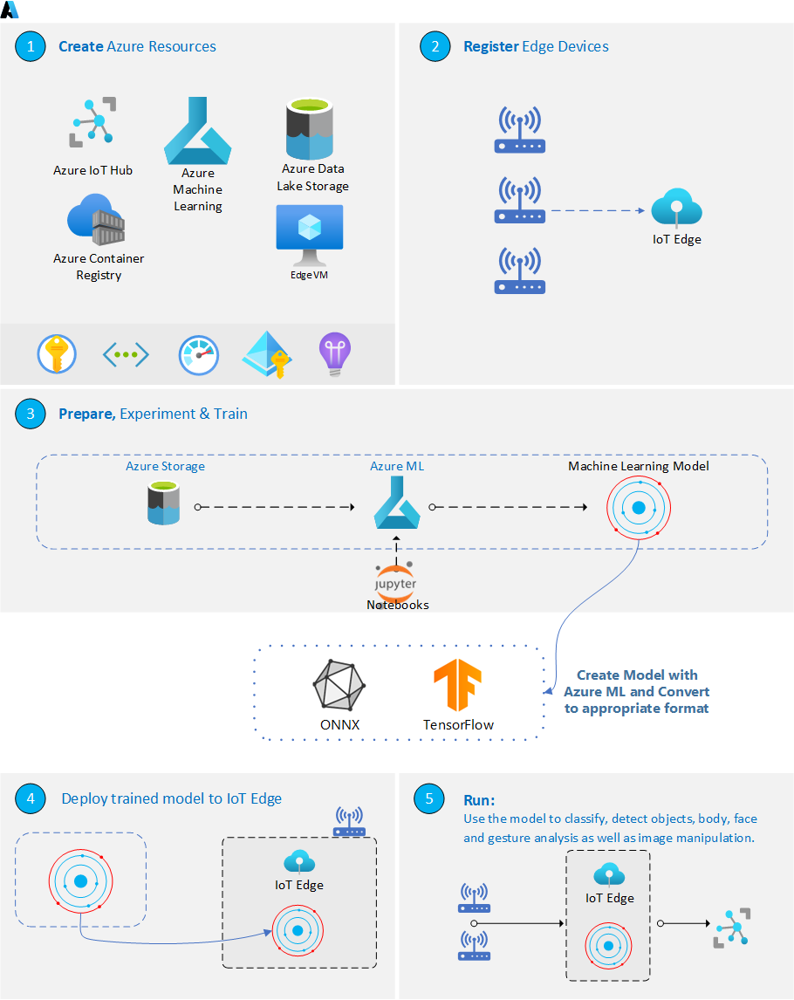

# EdgeAI in-a-box


## Use Case
Orchestration of resources for the entire Edge AI model lifecycle, including creation, deployment, and proper packaging through Azure ML and IoT Edge. This involves leveraging key components such as IoT Hub, IoT Edge, Azure ML, and Azure ML CLI V2.

## Why Edge AI?
Edge AI excels in diverse applications like image classification, object detection, body, face, and gesture analysis, as well as image manipulation. Moreover, in this swiftly evolving Generative AI (Gen AI) landscape, the move from cloud-based Gen AI to Edge Gen AI is becoming more prominent. This shift is not just desirable but increasingly necessary, propelled by demands for privacy, security, hyper-personalization, accuracy, cost-effectiveness, energy efficiency, and more. While the commercialization of today’s cloud-based Gen AI is in full swing, there are efforts underway to optimize the models built for power-guzzling GPU server farms to run on power-sipping edge devices with efficient mobile GPUs, Neural and Tensor processors (NPU and TPU).

With this in mind, we aim to simplify the process for users: creating a model, packaging it, and deploying it to the edge. The series kicks off by establishing the baseline of creating and deploying a model with Azure ML and IoT Edge. We'll then explore more specific scenarios, such as deploying a model with AKS and AKS Edge, and dive into creating a model with ONNX Runtime to highlight its advantages—allowing training in a preferred environment and deployment anywhere, be it on the cloud or edge. Similar attention will be given to OpenVIno. Our ultimate goal is to provide a clear understanding of various options and scenarios, guiding you into the realm of Edge Gen AI and facilitating a seamless transition.

## Why does AI-in-a-Box have an Edge AI Section?
AI-in-a-Box encompasses four vital domains within Azure AI/ML:

1.	**Azure ML:** This involves exploring the Azure ML Workspace and leveraging its capabilities to operationalize the creation of AI models.
2.	**Azure AI Services Integration:** This domain focuses on the seamless integration and utilization of prebuilt models through APIs on the Azure AI Services front.
3.	**GenAI Exploration & Acceleration:** This area delves into the realm of Generative AI (GenAI) and the effective utilization of Large Language Models (LLMs).
4.	**Edge AI:** Within this domain we address the creation of crucial Azure Resources for Edge AI scenarios, delve into model development, packaging and deployment. The central focus is on orchestrating the synergy between Azure Resources and positioning AI models as close to the edge as possible.

Edge AI is pivotal in extending AI and ML capabilities directly to edge devices, emphasizing the significance of running AI models on these devices and highlighting the essential interplay between various services in Azure. In summary, Edge AI enhances operational efficiency by bringing AI capabilities closer to the data source.

The provided accelerators introduce a comprehensive flow that streamlines the deployment of deep learning models on Edge devices or Edge-compatible Docker containers. These accelerators pave the way for seamless integration into real-world applications.

## Solution Architecture


### The above architecture is explained step-by-step below:

## Prerequisites
* An [Azure subscription](https://azure.microsoft.com/en-us/free/).
* Install latest version of [Azure CLI](https://docs.microsoft.com/en-us/cli/azure/install-azure-cli-windows?view=azure-cli-latest)
* Install [Azure Developer CLI](https://learn.microsoft.com/en-us/azure/developer/azure-developer-cli/install-azd)
* Install [Azure IoT Extension](https://github.com/Azure/azure-iot-cli-extension) for Azure CLI
    * az extension add --name azure-cli-iot-ext
* Install latest version of [Bicep](https://docs.microsoft.com/en-us/azure/azure-resource-manager/bicep/install)
* Prepare your Linux virtual machine or physical device for [IoT Edge](https://learn.microsoft.com/en-us/azure/iot-edge/how-to-provision-single-device-linux-symmetric)

## Deployment Flow 

**Step 1.** Clone the [AI-in-a-Box repository](https://github.com/Azure/AI-in-a-Box)

**Step 2.** Create Azure Resources (User Assigned Managed Identity, IoT Hub, Azure ML Workspace, Container Registry, IoT Edge Devices, IoT Edge VM)

**Step 2.** Configure Edge Device and Create Edge VM if you would like

**Step 3.** Buld ML model into docker image

**Step 4.** Deploy ML model on IoT Edge

**Step 5.** Test ML Module

## Deploy to Azure

1. Log into your Azure subscription: 
    ```
    azd auth login
    ```

1. Clone this repository locally: 

    ```
    git clone https://github.com/Azure/AI-in-a-Box
    cd edge-ai-in-a-box/iotedge-ai-in-a-box
    ```

2. Deploy resources:
    ```
    azd up
    ```

    You will be prompted for a subcription, and region.


## Post Deployment
Once your resources have been deployed you will need to do the following to get the notebooks up running and your Edge VM or device functioning properly:

* When running the notebooks your user won't have permission to alter the storage account. Please Ensure that you have been assigned both Storage Blob Data Reader and Storage Blob Data Contributor roles.

* Once the VM is deployed or your physical device is setup you can ssh into the VM/device using the below command   
    * ssh NodeVMAdmin@edgevm1.eastus.cloudapp.azure.com -p 2222 
* Once connected to your virtual machine, [verify](https://learn.microsoft.com/en-us/azure/iot-edge/quickstart-linux) that the runtime was successfully installed and configured on your IoT Edge device.
    * sudo iotedge system status
    * sudo iotedge list
    * sudo iotedge check