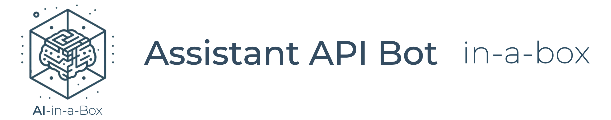

# Assistant API Bot in-a-box


This project deploys a virtual Assistant template to Azure.

## Solution Architecture

The solution architecture is described in the diagram below.


The flow of messages is as follows:

- End-users connect to a messaging channel your bot is publised to, such as Web, a PowerBI dashboard or Teams;
- Messages get processed through Azure Bot Services, which communicates with a .NET application running on App Services.
- The .NET application connects to the Assistants API, creates a new thread for each conversation.
- Every time a new message comes through, it is added to the thread, and an Assistant is executed on the thread to respond.
- The .NET application waits for the Assistant to conclude processing, while providing feedback to the user.
- Once the Assistant completes work, its response is posted to the user.

## Pre-requisites

- For running locally:
    - [Install .NET](https://dotnet.microsoft.com/en-us/download);
    - [Install Bot Framework Emulator](https://github.com/Microsoft/BotFramework-Emulator);

- For deploying to Azure:
    - Install Azure CLI
    - Install Azure Developer CLI
    - Log into your Azure subscription

    ```
    azd auth login
    ```

## Deploy to Azure

1. Clone this repository locally: 

```
git clone https://github.com/Azure/AI-in-a-Box
cd gen-ai/assistant-bot-in-a-box
```
2. Deploy resources:
```
azd up
```
You will be prompted for a subcription, region and model information. Keep regional model availability when proceeding.

3. Go to the Azure OpenAI Studio and create an Assistant with the tools you want to use. Alternatively, you can also use the API.

> Important: currently, this application only supports Code Interpreter. Other tools will be implemented in the near future.


4. Add your newly created Assistant's ID in the AOAI_ASSISTANT_ID environment variable.


5. Test on Web Chat - go to your Azure Bot resource on the Azure portal and look for the Web Chat feature on the left side menu.


## Running Locally (must deploy resources to Azure first)

After running the deployment template, you may also run the application locally for development and debugging.

- Make sure you have the appropriate permissions and are logged in the Azure CLI. The `AI Developer` role at the resource group level is recommended.
- Go to the `src` directory and look for the `appsettings.example.json` file. Rename it to `appsettings.json` and fill out the required service endpoints and configurations
- Execute the project:
```
    dotnet run
```
- Open Bot Framework Emulator and connect to http://localhost:3987/api/messages
- Don't forget to enable firewall access to any services where it may be restricted. By default, SQL Server will disable public connections.

## Keywords

- Send "clear" to delete the current thread;
- Send "logout" to sign out when SSO is enabled;

## Enabling Web Chat

To deploy a Web Chat version of your app:

- Go to your Azure Bot Resource;
- Go to Channels;
- Click on Direct Line;
- Obtain a Direct Line Secret;
- Add the secret to your App Service's environment variables, under the key DIRECT_LINE_SECRET;
- Your bot will be available at https://APP_NAME.azurewebsites.net.

Please note that doing so will make your bot public, unless you implement authentication / SSO.

## Contributing

This project welcomes contributions and suggestions.  Most contributions require you to agree to a
Contributor License Agreement (CLA) declaring that you have the right to, and actually do, grant us
the rights to use your contribution. For details, visit https://cla.opensource.microsoft.com.

When you submit a pull request, a CLA bot will automatically determine whether you need to provide
a CLA and decorate the PR appropriately (e.g., status check, comment). Simply follow the instructions
provided by the bot. You will only need to do this once across all repos using our CLA.

This project has adopted the [Microsoft Open Source Code of Conduct](https://opensource.microsoft.com/codeofconduct/).
For more information see the [Code of Conduct FAQ](https://opensource.microsoft.com/codeofconduct/faq/) or
contact [opencode@microsoft.com](mailto:opencode@microsoft.com) with any additional questions or comments.

## Trademarks

This project may contain trademarks or logos for projects, products, or services. Authorized use of Microsoft 
trademarks or logos is subject to and must follow 
[Microsoft's Trademark & Brand Guidelines](https://www.microsoft.com/en-us/legal/intellectualproperty/trademarks/usage/general).
Use of Microsoft trademarks or logos in modified versions of this project must not cause confusion or imply Microsoft sponsorship.
Any use of third-party trademarks or logos are subject to those third-party's policies.
