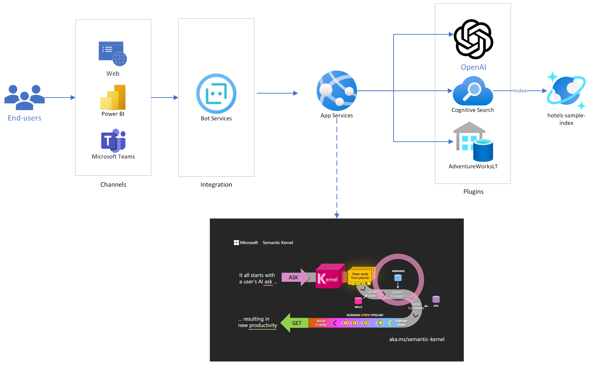
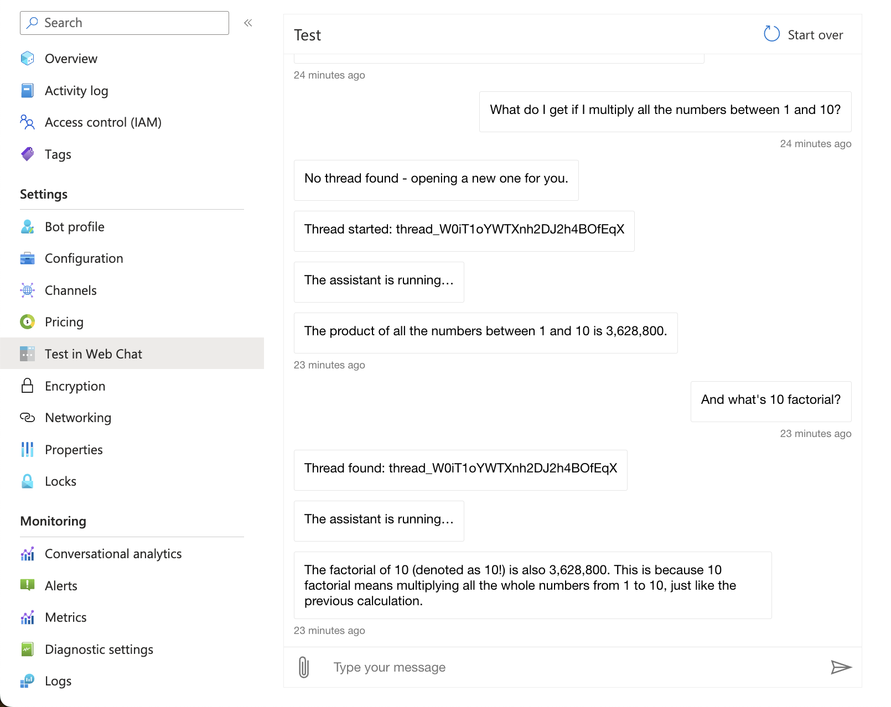

# Assistants API Bot in-a-Box


### Overview

This sample provides a step-by-step guide on how to deploy a virtual assistant leveraging the Azure OpenAI Assistants API. It covers the infrastructure deployment, configuration on the AI Studio and Azure Portal, and end-to-end testing examples.

### Objective

The main objective of this tutorial is to help users understand how to leverage the Assistants API to create a fully-fledged virtual assistant application.
By the end of this tutorial, you should be able to:

 - Deploy the necessary infrastructure to support an Azure OpenAI Assistant
 - Configure as Assistant with the required tools
 - Connect a Bot Framework application to your Assistant to deploy the chat to multiple channels

### Programming Languages
 - C#

### Estimated Runtime: 30 mins

### Solution Architecture

The solution architecture is described in the diagram below.



The flow of messages is as follows:

- End-users connect to a messaging channel your bot is published to, such as Web, a PowerBI dashboard or Teams;
- Messages get processed through Azure Bot Services, which communicates with a .NET application running on App Services.
- The .NET application connects to the Assistants API, creates a new thread for each conversation.
- Every time a new message comes through, it is added to the thread, and an Assistant is executed on the thread to respond.
- The .NET application waits for the Assistant to conclude processing, while providing progress updates to the user.
- Once the Assistant completes work, its response is posted to the user.

### Pre-requisites

- For running locally:
    - [Install .NET](https://dotnet.microsoft.com/en-us/download);
    - [Install Bot Framework Emulator](https://github.com/Microsoft/BotFramework-Emulator);

- For deploying to Azure:
    - Install Azure CLI
    - Install Azure Developer CLI
    - Log into your Azure subscription

    ```
    azd auth login
    ```

### Deploy to Azure

1. Clone this repository locally: 

```
git clone https://github.com/Azure/AI-in-a-Box
cd gen-ai/Assistants/bot-in-a-box
```
2. Deploy resources:
```
azd up
```
You will be prompted for a subscription, region and model information. Keep regional model availability when proceeding.

3. Test on Web Chat - go to your Azure Bot resource on the Azure portal and look for the Web Chat feature on the left side menu.



### Running Locally (must deploy resources to Azure first)

After running the deployment template, you may also run the application locally for development and debugging.

- Make sure you have the appropriate permissions and are logged in the Azure CLI. The `AI Developer` role at the resource group level is recommended.
- Go to the `src` directory and look for the `appsettings.example.json` file. Rename it to `appsettings.json` and fill out the required service endpoints and configurations
- Execute the project:
```
    dotnet run
```
- Open Bot Framework Emulator and connect to http://localhost:3987/api/messages
- Don't forget to enable firewall access to any services where it may be restricted. By default, SQL Server will disable public connections.

### Keywords

- Send "clear" to delete the current thread;
- Send "logout" to sign out when SSO is enabled;

## Enabling SSO

You can enable Single-Sign-On for your bot so that it identifies the user and keeps a token in context, that can later be used to retreive personal information like their name/job title, as well as for Microsoft Graph API calls.

To enable SSO, follow the steps below. Please note that you should be an `Entra ID Application Developer` and a `Contributor` in the resource group in order to perform the following actions. You can also perform these steps in the portal if you prefer.

- Load the required configurations. Hint: If you just deployed using Azure Developer CLI, you can run `azd env get-values` to retrieve these variables.
```sh
TENANT_ID=$(az account show --query tenantId -o tsv)
APP_REGISTRATION_NAME=[choose app registration display name]
AZURE_RESOURCE_GROUP_NAME=...
BOT_NAME=...
```

- Create an App Registration and retrieve its ID and Client ID.
```sh
APP=$(az ad app create --display-name $APP_REGISTRATION_NAME --web-redirect-uris https://token.botframework.com/.auth/web/redirect)
APP_ID=$(echo $APP | jq -r .id)
CLIENT_ID=$(echo $APP | jq -r .appId)
```
- Create a client secret for the newly created app
```sh
SECRET=$(az ad app credential reset --id $APP_ID)
CLIENT_SECRET=$(echo $SECRET | jq -r .password)
```

- Create an SSO configuration for your bot, passing in the App Registration details
```sh
az bot authsetting create --resource-group $AZURE_RESOURCE_GROUP_NAME --name $BOT_NAME --setting-name default --client-id $CLIENT_ID --client-secret $CLIENT_SECRET --parameters TenantId=$TENANT_ID --service aadv2 --provider-scope-string User.Read
```

- Configure the App Service to use the SSO configuration.
```sh
az webapp config appsettings set -g $AZURE_RESOURCE_GROUP_NAME -n $APP_NAME --settings SSO_ENABLED=true SSO_CONFIG_NAME=default
```

- Clear sensitive variables from terminal
```sh
SECRET=
CLIENT_SECRET=
```

### Enabling Web Chat

To deploy a Web Chat version of your app:

- Go to your Azure Bot Resource;
- Go to Channels;
- Click on Direct Line;
- Obtain a Direct Line Secret;
- Add the secret to your App Service's environment variables, under the key DIRECT_LINE_SECRET;
- Your bot will be available at https://APP_NAME.azurewebsites.net.

Please note that doing so will make your bot public, unless you implement authentication / SSO.

### Creating custom functions

To update function calling behavior or create your own functions, follow the steps below.

- Go to [./src/Tools](./src/Tools/)
- Create or update a JSON file with the function specification. You may also copy files from [./src/ToolsSamples](./src/ToolsSamples/) into [./src/Tools](./src/Tools/)
- Go to `_Tools.cs` and create or update the method with the same name as the function's "name" field. **Use only lowercase characters and underscores for names**.
- Redeploy with `azd up`. The Assistant definition will be updated automatically.