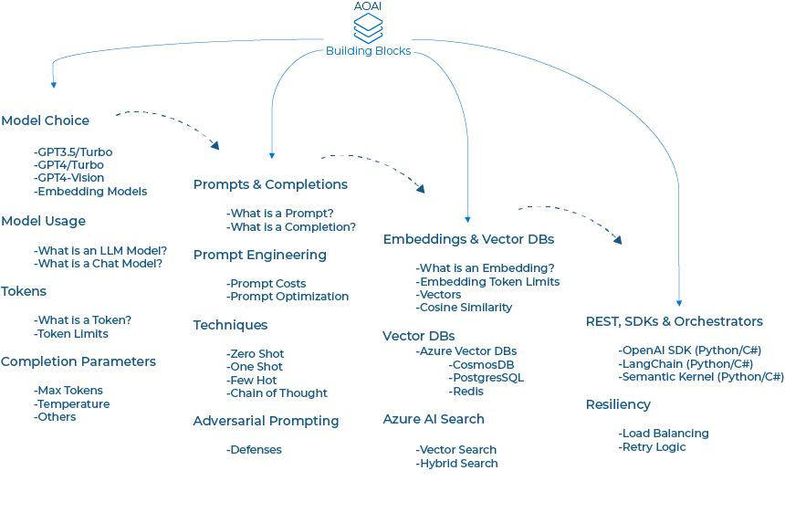
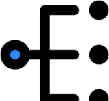

# Building Blocks

  

## Why Building Blocks?
Mastering the fundamentals and core concepts of OpenAI is indispensable for unlocking its full potential within Azure. Developers need a solid grasp of deploying Azure services like Azure OpenAI and Azure Cognitive Search, ensuring secure deployment aligned with responsible AI practices. This foundational knowledge guarantees that applications built on these services are not only functional but also ethically sound.

Moreover, proficiency in interacting with OpenAI's Large Language Models (LLMs) via REST API is crucial for seamless integration into diverse applications. Developers must understand the underlying principles of OpenAI, including selecting the right model for specific tasks and discerning the advantages of different models in terms of token utilization and response precision. Understanding prompts, completions, chats and overall prompt engineering best practices is pivotal for crafting top-notch interactions with Azure OpenAI, whether it involves generating summaries, translations, or other functions.

Furthermore, advanced concepts like smart load balancing for OpenAI endpoints and fine-tuning models are essential for maximizing performance and ensuring application resilience. As AI applications become increasingly intricate, grasping these core concepts not only empowers developers to construct more efficient solutions but also aids in mitigating potential risks associated with sophisticated language models. By simplifying the understanding of how these core concepts interconnect, our goal is to enable developers to build smarter applications using Azure OpenAI.

## Landing Zone

## Open AI/Prompt

## App Blocks

## Fine Tuning

## Additional Resources

### Check out our  [ML/AI Edge MindMap](https://aka.ms/mledge-mm)

