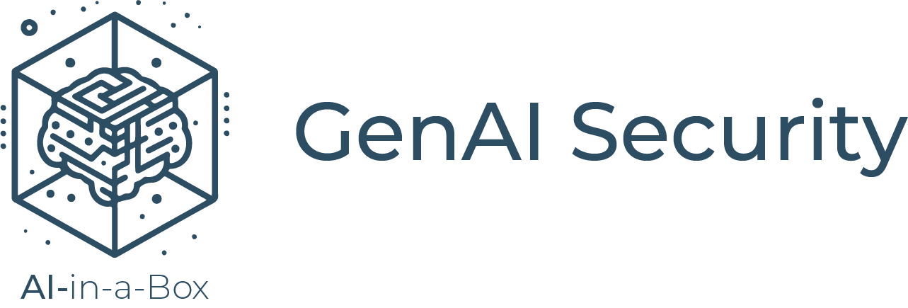
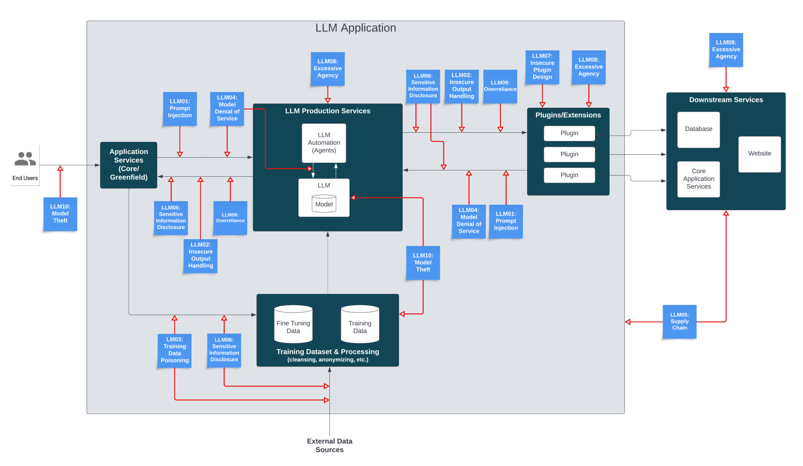

# Guidance: Security for Genenerative AI (GenAI) Applications

## Introduction
As LLMs become more easily available and integrated into our work and personal lives, the promise of the technology is tempered by the potential for it to be misused. And the potential for misuse becomes even more significant when you realize LLMs can be combined with other powerful software components and agents to orchestrate a pipeline of actions. OR combined with propriatary and personal data to introduce new avenues for data disclosure and leakage.   

The intention for this page is not to reiterate security guidance that is generally available for more traditional or cloud software applications but to focus on guidance specific to *GenAI* applications and the unique characteristics and challenges of LLMs.  

## Threats & Risks
The security threats and risks with traditional software applications are familiar and understood. *GenAI* and LLMs introduce new and unique security risks including:  
* **AI responses are based on statistical probabilities** or the best chance for correct output. LLMs generate convincing human-like responses by predicting what words come next in a phrase. While they can be great at helping with tasks like summarizing a document or explaining complicated concepts or boosting creativity, there can be issues like responses being inaccurate, incomplete, inappropriate, or completely fabricated. You may be familiar with one well known example where ChatGPT provided non-existant legal citations that lawyers presented in court: [Here's what happens when your lawyer uses ChatGPT](https://www.nytimes.com/2023/05/27/nyregion/avianca-airline-lawsuit-chatgpt.html).
* *GenAI* is **by design a non-deterministic technology** which means that given identical inputs, responses and output may differ.  
* *GenAI* applications **can be extended with agents, plugins, and even external APIs that can significantly expand the attack surface** for a *GenAI* application. For instance, an LLM may implicitly trust a plugin or 3rd party component that is malicious.  
* Another challenge with GenAI is that it **currently it is not possible to enforce an isolation boundary between the data and the control planes**. This means that LLMs are not always able to differentiate between data being submitted as content or an adversarial instruction submitted as content. Think about a SQL databases: instructions are supplied through query language and validated with a parser before data is queried, manipulated, or provided as output.  With a SQL injection attack, a malicious instruction can piggyback in on a ambiguously phrased language construct but it can be mitigated with a parameterized query. *GenAI*/LLMs do not have that boundary between syntax (control plane) and data and need to rely on other security practices. 

The diagram below is from [OWASP Top 10 for Large Language Model Applications](https://owasp.org/www-project-top-10-for-large-language-model-applications/assets/PDF/OWASP-Top-10-for-LLMs-2023-v1_1.pdf) and depicts the potential security risks for a hypothetical LLM app:  

 

## Security Strategies  
Infrastructure plays an indispensable role in helping create a secure landscape for *GenAI* applications, particularly cloud environments. Below are strategies tht can help ensure the security of a *GenAI* environment:    
* **Threat Modeling** Include *GenAI* apps in your threat modeling practice. Undertand that *GenAI* can extend attack surface with access to underlying or referenced data sources, access to model API keys, workflow orchestration, and agents and plugsins. Learn what can go wrong. 
  * [The AI Attack Surface Map v1.0](https://danielmiessler.com/p/the-ai-attack-surface-map-v1-0/)
* **Architecture strategies** help ensure  a secure, scalable, and available environment. 
  * [Baseline OpenAI end-to-end chat reference architecture](https://learn.microsoft.com/en-us/azure/architecture/ai-ml/architecture/baseline-openai-e2e-chat): a baseline architecture for building and deploying enterprise chat apps that use Azure OpenAI.
  * [OpenAI end-to-end baseline reference implementation](https://github.com/azure-Samples/openai-end-to-end-baseline): Author and run a chat app in a single region with Azure ML and OpenAI. 
* **Network strategies** help ensure that the cloud infrastructure is properly segmented and that access is controlled and monitored.  It includes implementing network segmentation, using secure protocols, enforcing Secure APIs and endpoints.  For GenAI specific recommendations:    
  * [Cognitive Services Laning Zone in-a-box](https://github.com/Azure/AI-in-a-Box/blob/kbaroni/cognitive-services-landing-zone-in-a-box/README.md)
* **Access and Identity strategies** to enforce user verification and provide a barrier to malicious access. When possible, use managed identities and RBAC to authenticate and authorize access and avoid use of *GenAI* service API keys for access. Another consideration to keep in mind is that access patterns like role or row level access to indexes may not be nativel supported. See:  
  * [Authentication & Authorization in GenAI Apps with Entra ID & Search](https://techcommunity.microsoft.com/t5/fasttrack-for-azure/authentication-and-authorization-in-generative-ai-applications/ba-p/4022277)
  * [Azure AI Search - Restricting access to indexes](https://learn.microsoft.com/en-us/azure/search/search-security-overview#restricting-access-to-documents)
* **Application strategies** help ensure the application is configured securely and vulnerabilities are identified and addressed:
    * Use App front end services to manage access and throughput. See: [Azure OpenAI Service Load Balancing with Azure API Management](https://learn.microsoft.com/en-us/samples/azure-samples/azure-openai-apim-load-balancing/azure-openai-service-load-balancing-with-azure-api-management/) and [Smart load balancing for OpenAI endpoints and Azure API Managment](https://techcommunity.microsoft.com/t5/fasttrack-for-azure/smart-load-balancing-for-openai-endpoints-and-azure-api/ba-p/3991616)
    * Ensure related services are deployed securely (AI Search, Cosmos DB, etc)
    * Secure and validate training data and injestion pipelines  
* **Governance strategies** help ensure the infrastructure is being used is meeting security and compliance requirements and that policies and procedures are in place to manage risk and accountability: 
  * Become familiar with Responsible AI principles and frameworks and integrate them early in the development of your application.  More here: [Responsible AI](./responsible-ai)
  * Leverage platform capabilities for logging, auditing, and monitoring *GenAI* apps.  See: [Implement logging and monitoring for Azure OpenAI models](https://learn.microsoft.com/en-us/azure/architecture/ai-ml/openai/architecture/log-monitor-azure-openai). 
  
## Adversarial Prompting

#### Attacks
An adversarial prompt attack is when a prompt is used to manipulate an LLM to generate a malicious or unintended response. A sneaky user can tamper with words or sentiment or sentence structure to exploit nuances in language models. You may be familiar with some types of prompt attacks:   
* [Prompt injection](https://www.promptingguide.ai/risks/adversarial#prompt-injection): the input, output, or instructions are manipulated to lead to unintended behavior.  
* [Prompt leaking](https://www.promptingguide.ai/risks/adversarial#prompt-leaking): intended to cause the model to leak confidential or proprietary information.   
* [Jailbreaking](https://www.promptingguide.ai/risks/adversarial#jailbreaking): a technique to bypass model safety mechanisms to generate illugal or unethical content. 
* [DAN](https://www.promptingguide.ai/risks/adversarial#dan): is an acronym for **D**o **A**nything **N**ow and is another technique intended to circumvent model saftety guardrails and force it to comply with requests that generate unfiltered responses.
* [Multi-prompt](): a series of prompts are used to extract private or sensitive information.
* Multi-language: this technique submits a request in languages other than English to cause the model to overlook or bypass security checks.
* Obfuscation (token smuggling): a technique to disguise or alter input output to circumvent checks or detection mechanisms. 

*Note*: Details about these and other adversarial techniques can be found here:    
* [Prompt Engineering Guide](https://www.promptingguide.ai/)
* [The EL15 Guide to Prompt Injection: Techniques, Prevention Methods & Tools](https://www.lakera.ai/blog/guide-to-prompt-injection)

#### Mitigations
As a mitigation strategy for adversarial prompt attacks, consider advanced [prompt engineering techniques](https://learn.microsoft.com/en-us/azure/ai-services/openai/concepts/advanced-prompt-engineering). There is a growing list of specific techniques that can be used that include enriching prompts with specific instructions, formatting, and providing examples of the kind of output content that is intended.  Below are some additional strategies to consider: 
  * **Defensive Instructions**: [Add defense in the instruction](https://github.com/dair-ai/Prompt-Engineering-Guide/blob/main/guides/prompts-adversarial.md#add-defense-in-the-instruction) to guide the model with explicit instructions and constraints.  Structure the [system message](https://learn.microsoft.com/en-us/azure/ai-services/openai/concepts/advanced-prompt-engineering?pivots=programming-language-chat-completions#system-message) with context and instructions. 
  * **Determine intent**: Use techniques like [few-shot learning](https://learn.microsoft.com/en-us/azure/ai-services/openai/concepts/advanced-prompt-engineering?pivots=programming-language-chat-completions#few-shot-learning) to provide content to the model and help set intent. 
  * **Monitor for degradation in output quality**: a decline in output quality can be an indication that a prompt has been tampered with. Some of the ways to monitor for output quality incude using metrics to measure and evaluate the prompt, human evaluation of feedback, and using adversarial test cases to validate prompt reslience. [Azure Machine Learning prompt flow](https://learn.microsoft.com/en-us/azure/machine-learning/prompt-flow/overview-what-is-prompt-flow?view=azureml-api-2) has built-in evaluation flows that enable users to assess the quality and effectiveness of prompts. 
  
  * **Use other models or dedicated services to process requests**. [Azure AI Content Safety](https://learn.microsoft.com/en-us/azure/ai-services/content-safety/) is an azure service that provides [content filtering](https://learn.microsoft.com/en-us/azure/ai-services/openai/concepts/content-filter?tabs=warning%2Cpython). AI models are used to detect and classify categories of harm from AI-generated content.  Content filters are more contextually aware than blocklists and can provide broad coverage without the manual creation of rules or lists. 
  * **Use inbound/outbound block/allow lists or filters or rules**. When there is a need to screen for items specific to a use case, blocklists can be helpful and can be implemented as part of the AI Content Safety service. See: [Use a blocklist in Azure OpenAI](https://learn.microsoft.com/en-us/azure/ai-services/openai/how-to/use-blocklists).
  * Use the native power of models to **steer zero- or few-shot prompting** strategies. See [promptbase](https://github.com/microsoft/promptbase) for a growing collection of resources, best practices, and sample scripts.  

See [Exploring Adversarial Prompting and Mitigations in AI-Infused Applications](https://www.linkedin.com/pulse/exploring-adversarial-prompting-mitigations-alex-morales-3sqne/) for more specifics on these types of attacks and defense tactics. 
  
## Resources & References
* [OWASP Top 10 for LLM applications](https://owasp.org/www-project-top-10-for-large-language-model-applications/) and the [downloadable whitepaper](https://www.llmtop10.com/assets/downloads/OWASP-Top-10-for-LLM-Applications-v1_1.pdf)
* [OWASP LLM AI Security & Governance Checklist](https://owasp.org/www-project-top-10-for-large-language-model-applications/llm-top-10-governance-doc/LLM_AI_Security_and_Governance_Checklist.pdf)
* [Security Best Practices for GenAI Applications in Azure](https://techcommunity.microsoft.com/t5/azure-architecture-blog/security-best-practices-for-genai-applications-openai-in-azure/ba-p/4027885)
* [Steering at the Frontier: Extending the Power of Prompting](https://www.microsoft.com/en-us/research/blog/steering-at-the-frontier-extending-the-power-of-prompting/)
* [Planning red teaming for large language models (LLMs) and their applications](https://learn.microsoft.com/en-us/azure/ai-services/openai/concepts/red-teaming)

