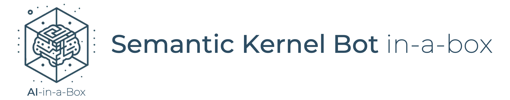
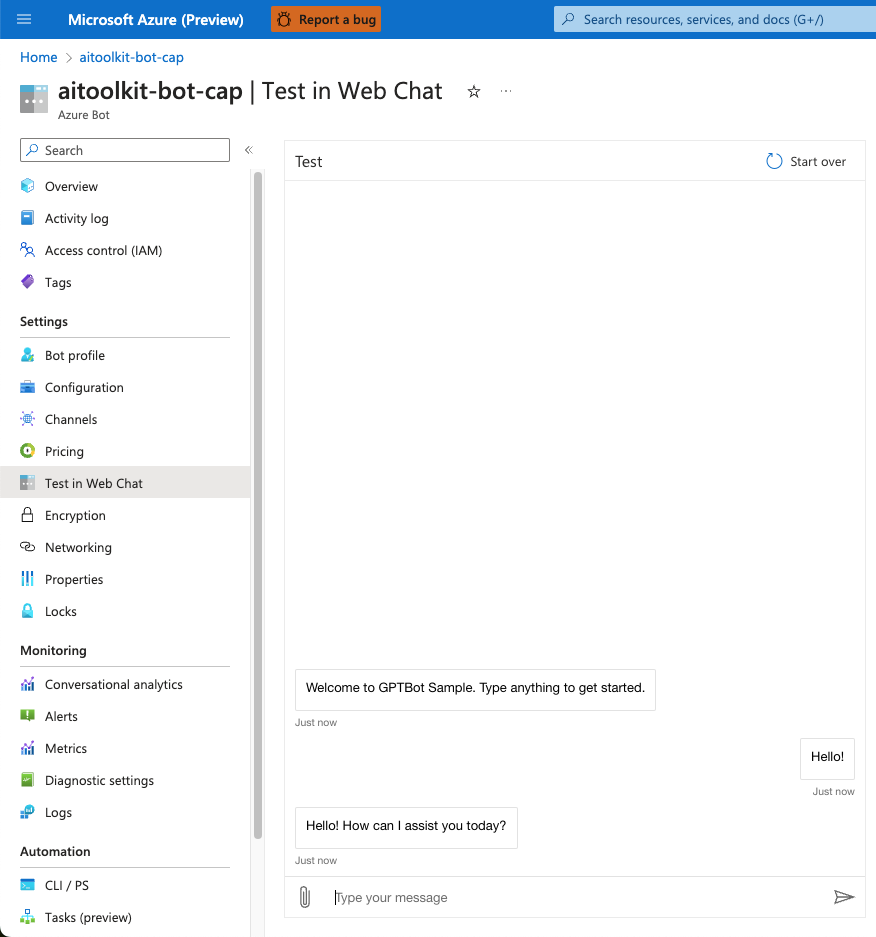
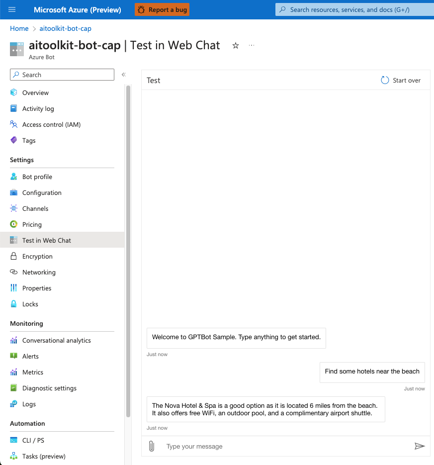
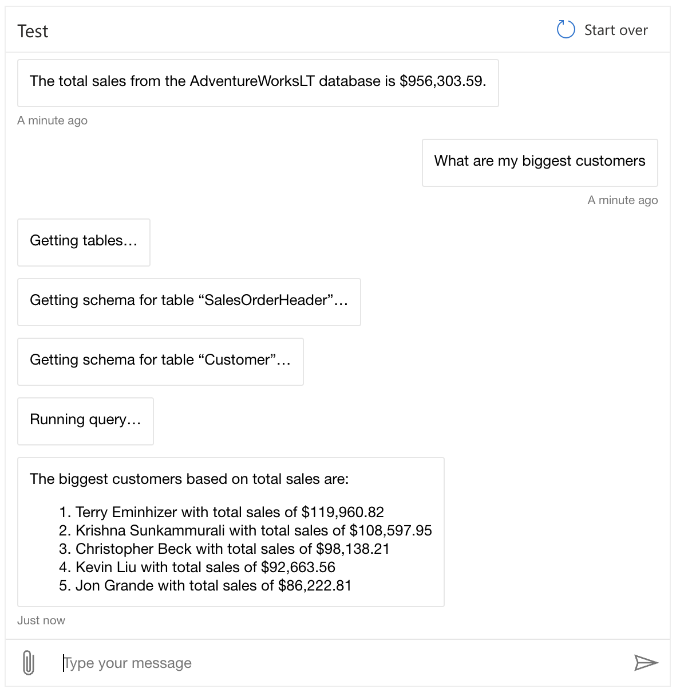
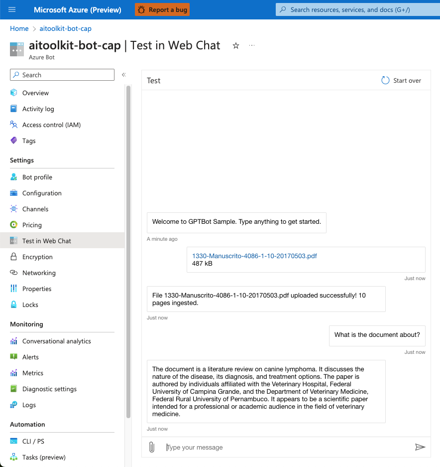

# Semantic Kernel Bot in-a-box


This project deploys an extensible Semantic Kernel bot template to Azure.

## Solution Architecture

The solution architecture is described in the diagram below.


The flow of messages is as follows:

- End-users connect to a messaging channel your bot is publised to, such as Web, a PowerBI dashboard or Teams;
- Messages get processed through Azure Bot Services, which communicates with a .NET application running on App Services.
- The .NET application runs a Semantic Kernel Stepwise Planner at its core. The planner elaborates a series of steps to process the user's request, and then executes it.
- Each step of the plan is formulated through Azure OpenAI, and the executed against Cognitive Search (traditional RAG pattern) or Azure SQL (structured data RAG).
- Cognitive search contains an index of hotels, while Azure SQL contains customer data from the AdventureWorksLT sample. Azure OpenAI is responsible for deciding which data source each question gets routed to. Questions may also span multiple data sources. Check out the Sample Scenarios section for more details.


## Pre-requisites

- For running locally:
    - [Install .NET](https://dotnet.microsoft.com/en-us/download);
    - [Install Bot Framework Emulator](https://github.com/Microsoft/BotFramework-Emulator);

- For deploying to Azure:
    - Install Azure CLI
    - Install Azure Developer CLI
    - Log into your Azure subscription

    ```
    azd auth login
    ```

## Deploy to Azure

1. Clone this repository locally: 

```
git clone https://github.com/Azure/AI-in-a-Box
cd semantic-kernel-bot-in-a-box
```
2. Deploy resources:
```
azd up
```
You will be prompted for a subcription, region and model information. Keep regional model availability when proceeding.

3. Test on Web Chat - go to your Azure Bot resource on the Azure portal and look for the Web Chat feature on the left side menu.




## Running Locally (must deploy resources to Azure first)

After running the deployment template, you may also run the application locally for development and debugging.

- Make sure you have the appropriate permissions and are logged in the Azure CLI. The `AI Developer` role at the resource group level is recommended.
- Go to the `src` directory and look for the `appsettings.example.json` file. Rename it to `appsettings.json` and fill out the required service endpoints and configurations
- Execute the project:
```
    dotnet run
```
- Open Bot Framework Emulator and connect to http://localhost:3987/api/messages
- Don't forget to enable firewall access to any services where it may be restricted. By default, SQL Server will disable public connections.

## Sample scenarios

The application has the ability to consume information from GPT-4 itself, Cognitive Search, SQL and documents uploaded by the end user directly. Each of these data sources will be preloaded with some sample data, but you may use the connections as templates to connect your own data sources.

You may ask about the following topics to test each functionality

1. General knowledge questions
    - Ask about any publicly available knowledge;


2. Retrieval-augmented generation (SearchPlugin)
    - Ask to look for hotels matching a description;


3. Structured data retrieval (SQLPlugin)
    - Ask about your customers and sales;


4. Upload documents as context (UploadPlugin)
    - Upload a file and ask questions about it;


5. Generate images (DALLEPlugin)
    - Ask to generate images;


## Keywords

- Send "clear" to reset the conversation context;
- Send "logout" to sign out when SSO is enabled;

## Developing your own plugins

This project comes with a few plugins, which may be found in the Plugins/ directory. You may use these as examples when developing your own plugins.

To create a custom plugin:

- Add a new file to the Plugins directory. Use one of the examples as a template.
- Add your code to the plugin. Each Semantic Function should contain a top-level description, and a description of each argument, so that Semantic Kernel may understand how to leverage that functionality.
- Load your plugin in the Bots/SemanticKernelBot.cs file

And you're done! Redeploy your app and Semantic Kernel will now use your plugin whenever the user's questions call for it.

## Enabling Web Chat

To deploy a Web Chat version of your app:

- Go to your Azure Bot Resource;
- Go to Channels;
- Click on Direct Line;
- Obtain a Direct Line Secret;
- Add the secret to your App Service's environment variables, under the key DIRECT_LINE_SECRET;
- Your bot will be available at https://APP_NAME.azurewebsites.net.

Please note that doing so will make your bot public, unless you implement authentication / SSO.

## Contributing

This project welcomes contributions and suggestions.  Most contributions require you to agree to a
Contributor License Agreement (CLA) declaring that you have the right to, and actually do, grant us
the rights to use your contribution. For details, visit https://cla.opensource.microsoft.com.

When you submit a pull request, a CLA bot will automatically determine whether you need to provide
a CLA and decorate the PR appropriately (e.g., status check, comment). Simply follow the instructions
provided by the bot. You will only need to do this once across all repos using our CLA.

This project has adopted the [Microsoft Open Source Code of Conduct](https://opensource.microsoft.com/codeofconduct/).
For more information see the [Code of Conduct FAQ](https://opensource.microsoft.com/codeofconduct/faq/) or
contact [opencode@microsoft.com](mailto:opencode@microsoft.com) with any additional questions or comments.

## Trademarks

This project may contain trademarks or logos for projects, products, or services. Authorized use of Microsoft 
trademarks or logos is subject to and must follow 
[Microsoft's Trademark & Brand Guidelines](https://www.microsoft.com/en-us/legal/intellectualproperty/trademarks/usage/general).
Use of Microsoft trademarks or logos in modified versions of this project must not cause confusion or imply Microsoft sponsorship.
Any use of third-party trademarks or logos are subject to those third-party's policies.
