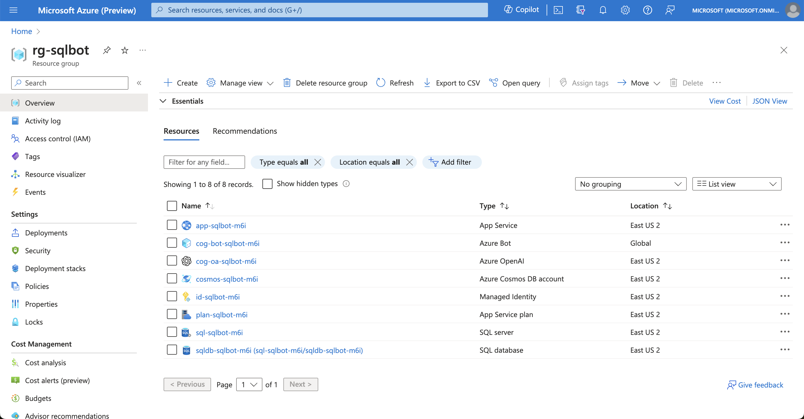
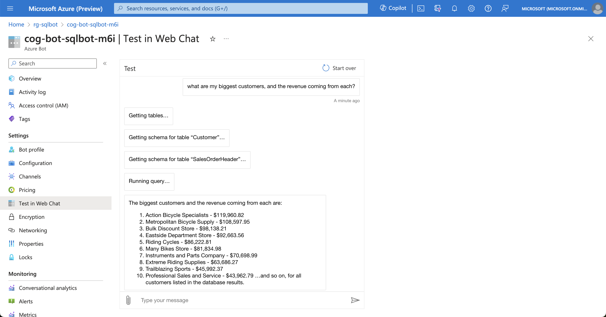

# SQL-powered GenAI Assistant

Deploy an assistant capable of running SQL queries on your database to respond to questions.
This sample uses AdventureWorksLT out of the box, and can be customized to your own database.

## Sample questions

- How much in total sales do we have?
- What are my biggest customers?
- What are my top selling products?

## Recommended deployment parameters

To deploy this solution, use the [Semantic Kernel Bot in-a-box](../README.md) accelerator with the following parameters:

    Azure location = East US 2
    gptModel = gpt-4
    gptVersion = 1106-preview
    deploySql = true
    publicNetworkAccess = true

## Deployment validation

After deployment, you should see the following resources on your Azure subscription.

Go to the Azure Bot resource and ask the sample questions to verify that the deployment was successful:

## Customization steps

Once the sample is deployed, you will likely want to connect the assistant to your own database.
To do this, follow the steps below:

- Update the environment variable SQL_CONNECTION_STRING to point to your own SQL database. You may use the existing MSI to connect, or choose a different authentication method;
- Update the file [src/Plugins/SQLPlugin.cs](../src/Plugins/SQLPlugin.cs) with information about your data. This includes:
    1. The method descriptions should describe the type of information found on the database;
    2. Any additional information about the data that might help the model consume it;
    3. Optionally, add other pre-canned methods that might be more targeted to your database. This will reduce the possibility of errors

## Notes

- Always use the bare minimum access you can grant to SQL via large language model. Assume end-users will have full control of that user, regardless of guidelines provided in the prompt. This pattern is not suitable for giving write access to real data.
- This plugin will heavily rely on column names and prompt instructions to draw information from the right tables. Consider building a schema of views for the AI to read from, rather than directly.
- Limit result sets as much as possible to reduce hallucinations.
- Do not expect the AI to perform calculations outside of those performed by SQL commands.