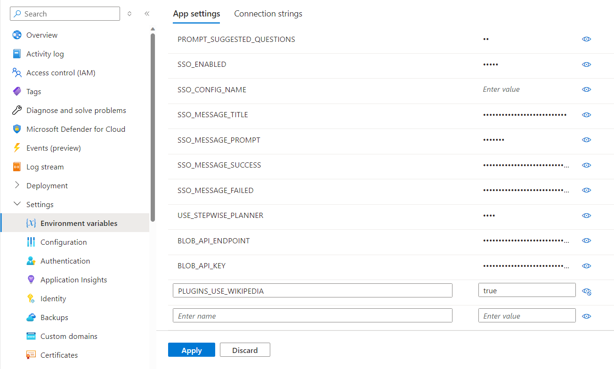

# Custom data API Retrieval-Augmented Generation

Deploy an assistant that consumes data from an external API to respond to questions.
This sample will use the Wikipedia API as a starting point.

## How this scenario works

- User sends a question to the Assistant
- Assistant uses the [WikipediaPlugin](../src/Plugins/WikipediaPlugin.cs) to retrieve articles that might contain the necessary information with the QueryArticles function
- Assistant reads the first article returned with the GetArticle function
- Assistant formulates a response and sends a message back to the user

## Sample questions

- What was the team aboard the Apollo 11?
- What is the fastest animal on the planet?

## Recommended deployment parameters

To deploy this solution, use the [Semantic Kernel Bot in-a-box](../README.md) accelerator with the following parameters:

    Azure location = East US 2
    gptModel = gpt-4
    gptVersion = 1106-preview
    publicNetworkAccess = true

## Additional steps

After the solution is deployed, enable the Wikipedia plugin by changing the ´PLUGIN_USE_WIKIPEDIA´ environment variable to ´true´.

## Deployment validation

Ask the sample questions to verify that the deployment was successful:

## Customization steps

Once the sample is deployed, you may want to connect the assistant to other APIs. To do this, follow the steps below:

- Add a new Plugin by duplicating and renaming the WikipediaPlugin and adding it in [SemanticKernelBot](../src/Bots/SemanticKernelBot.cs)
- Notice that each method calls out to an endpoint, and returns the content of the response as a string. Customize the methods to reflect the endpoints you would like to call.
- Optionally add more methods to the class to cover all the API operations your bot will need.

## Notes

- Assume end users will have full control over any APIs you make available to them. This is even more critical when exposing write operations or non-public endpoints.
- If possible, avoid requests to unrestricted domains (e.g. passing the entire URL as a parameter).
-  Account for the possibility of inputs crafted with bad intent. Be aware of ways these inputs can be manipulated to change the behavior of the plugin in unexpected ways.