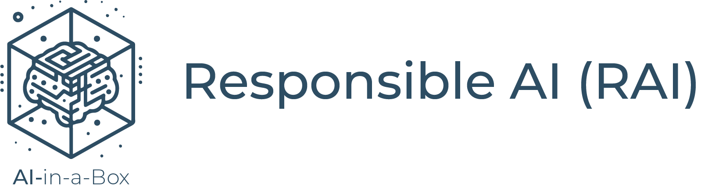
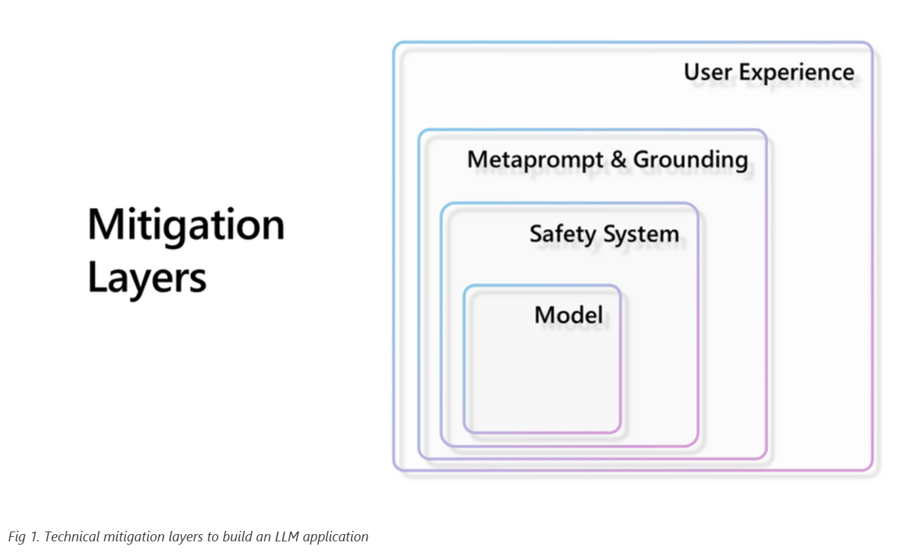

# Guidance: Responsible AI (RAI)

## Introduction
There is a lot to be excited about with recent advances in AI and LLM technology, but every day there are examples in the media about where and how it has gone wrong. As AI is integrated into more of our daily work and personal lives it can cause minor inconveniences, such as mistakenly canceled appointments, to more serious issues, such as potential job displacement and privacy compromises — and may even compound already existing social or economic inequities. All of us who design, develop, and deploy AI have a responsibility to confront the risks that the technology introduces.

**If your team makes use of AI APIs or AI systems or designs, develops, or deploys AI, please consider joining us in the commitment to innovate responsibly.**  This page contains recommendations and guidance for how to get started.  

## Get Started
RAI sounds promising.  Who wouldn't want their product to be responsible or trustworthy?  But there can be challenges:
* AI sysems are complex and require a diversity of teams, skills, and tools
* Potential harms and risks of AI systems are different from those of traditional software systems
* Leadership support is crucial for a sustainable RAI practice
  
The recommendations that follow are based on lessons learned from rolling out a responsible AI practice across one of the organizations within Microsoft. As you review the recommendations, keep in mind they should be *adapted to fit your organization, circumstances, and product plans*. 

The approach used was grounded in principles, standards, practices that were used internally and are published here:   
* **[Microsoft AI principles](https://www.microsoft.com/en-us/ai/principles-and-approach)** of fairness, reliability and safety, privacy and security, Inclusiveness, Transparency, and Accountability. However your organization defines and prioritizes the principles, they become the foundation for RAI standards and practices. 
* **[Microsoft Responsible AI Standard, v2](https://query.prod.cms.rt.microsoft.com/cms/api/am/binary/RE5cmFl)**: The RAI standard is the first step in putting the principles into practice.  It answers the question... *How are we going to execute on a responsible AI practice...?*. For each principle, the standard sets out concrete steps and outcomes. 
* **[Microsoft Responsible AI Impact Assessment Template](https://query.prod.cms.rt.microsoft.com/cms/api/am/binary/RE5cmFk)** and **[Impact Assessment Guide](https://blogs.microsoft.com/wp-content/uploads/prod/sites/5/2022/06/Microsoft-RAI-Impact-Assessment-Guide.pdf)** provides documentation and guidance for how a team can capture and document the benefits, potential harms and mitigations for an AI system.  
* **RAI tools and guidance** such as the Responsible AI Maturity Model, HAX Toolkit, RAI Toolbox, and more (link [here](https://aka.ms/rai)).
  
## Complete an impact assessment
A *Responsible AI impact assessment* is the process a product team follows to identify and assess the potential risks and harms of an AI system.  It is a new process, and some organizations may be reluctant to consider it, giving reasons such as:
* *It is still too early in AI lifecycle to do impact assessments. RAI is mostly academic*.
* *AI is so new. How can we expect product teams to know about potential risks and harms?*
* *Discussions around RAI will only devolve into messy disagreements and take time away from design/development/deployment timelines.*

An RAI impact assessment is the primary method for guiding a team through the process of examining an AI system and aligning it to responsible AI principles and standards. The questions it examines include: *What are the use cases for the AI system? Who are the stakeholders? How do we monitor and measure AI? Who might be harmed and how? How do we prevent these harms?*

The purpose of a good RAI impact assessment is to identify the potential risks and harms of an AI system and introduce mitigations to reduce negative consequences. The templates and guidance introduced above can help a team put responsible AI principles to work.  Consider adjustments to better align with your organizational requirements and product team processes. 

Plan to update an impact assessment on an ongoing basis as use cases change, new functionality or technology is introduced, or even as the statistical property of the training data changes over time (data drift).  

## Strategies to help
The pace of AI is moving quickly and a variety of methods are needed to help measure and advance the responsible design, development, and deployment of AI systems. 

#### Adopt a layered mitigation approach for RAI
  At Microsoft, we recommend a layered mitigation approach that combines technical, operational, and governance measures to reduce the potential harms of LLMs. A layered approach applies different measures at different stages of development and deployment as documented in the article [Deploy large language models responsibly with Azure AI](https://techcommunity.microsoft.com/t5/ai-machine-learning-blog/deploy-large-language-models-responsibly-with-azure-ai/ba-p/3876792) and depicted below:

See [Harms mitigation strategies with Azure AI](https://learn.microsoft.com/en-us/azure/ai-studio/concepts/evaluation-improvement-strategies) for a walk-through of the mitigation layers.  
 
#### Get started with RAI metrics 
  Measuring RAI involves both *technical attributes*, like accuracy and security, and *socio-technical attributes* such as fairness, representational harms, or safety and reliability. A starter set of metrics could include platform, usage, and operational level metrics like:
    * *resource consumption* (GPU, CPU, memory utilization, response times), 
    * *response/request tracking* (number of unique/active users, requests, prompts, token usage), and
    * *operational metrics* (quota, capacity, latency, throttling). See [Monitoring Azure OpenAI Service](https://learn.microsoft.com/en-us/azure/ai-services/openai/how-to/monitoring).

  Add to this a layer of metrics to measure the potential for RAI harms identified through the impact assessment process. Consider measuring the number of input prompts blocked, number of responses blocked, number of jailbreak attempts, or metrics related to quality of generated output such as groundedness, relevance, and similarity. 

  #### Tools to support RAI
  Tools can be a particular challenge because the RAI tools landscape is relatively new and rapidly evolving. While there are libraries and building blocks, the overall landscape can seem fragmented, making it difficult to establish an end-to-end workflow. Some of the challenges include: 
* There is no single tool that can holistically assess potential AI harms.
* Tools often do not map directly to an RAI principle or standard, such as *fairness* or *transparency*, making it difficult to determine an appropriate tool.  
* Components and libraries built to support distinct aspects of RAI practice often require additional effort to use them in a complementary way.
  
Tools to support an RAI practice for *GenAI* applications focus on model selection, prompt engineering, and model output. Recommendations include:
  *  **[Azure AI Content Safety](https://learn.microsoft.com/en-us/azure/ai-services/content-safety/)**: An azure service that provides [content filtering](https://learn.microsoft.com/en-us/azure/ai-services/openai/concepts/content-filter?tabs=warning%2Cpython). AI models are used to detect and classify categories of harm from AI-generated content.  Content filters are more contextually aware than blocklists and can provide broad coverage without the manual creation of rules or lists. 
  *  **Blocklists**: When there is a need to screen for items specific to a use case, blocklists can be helpful and can be implemented as part of the AI Content Safety service. See: [Use a blocklist in Azure OpenAI](https://learn.microsoft.com/en-us/azure/ai-services/openai/how-to/use-blocklists).
  *  **Meta-prompt best practices**: To mitigate harms, apply recommended prompt engineering practices. See: [Introduction to prompt engineering](https://learn.microsoft.com/en-us/azure/ai-services/openai/concepts/prompt-engineering) and [Prompt engineering techniques](https://learn.microsoft.com/en-us/azure/ai-services/openai/concepts/advanced-prompt-engineering).
  *  **Prompt template recommendations**: Example templates to help write effective system messages to guide AI system behavior: See [System message framework and template recommendations for Large Language Models (LLMs)](https://learn.microsoft.com/en-us/azure/ai-services/openai/concepts/system-message?source=recommendations).
  *  **Prompt flow**: [Azure Machine Learning prompt flow](https://learn.microsoft.com/en-us/azure/machine-learning/prompt-flow/overview-what-is-prompt-flow?view=azureml-api-2) is a development tool designed to streamline the entire development cycle of AI applications.  Specific to RAI are the built-in evaluation flows that enable users to assess the quality and effectiveness of prompts. 
  
 ## Resources & References
Here are additional RAI resources: 
* [Microsoft AI principles](https://www.microsoft.com/en-us/ai/principles-and-approach) 
* [Microsoft Responsible AI Standard, v2](https://query.prod.cms.rt.microsoft.com/cms/api/am/binary/RE5cmFl) 
* [Microsoft Responsible AI Impact Assessment Template](https://query.prod.cms.rt.microsoft.com/cms/api/am/binary/RE5cmFk)
* [Responsible AI tools and guidance](https://aka.ms/rai) and [HAX Tookit](https://www.microsoft.com/en-us/haxtoolkit/)
* Video: [An introduction to responsible AI (RAI) process](https://learn.microsoft.com/en-us/shows/learn-live/fasttrack-for-azure-season-3-ep07-an-introduction-to-responsible-ai-rai-process)
* Medium articles: [Responsible AI in action, Part 1: Get started](https://medium.com/data-science-at-microsoft/responsible-ai-in-action-part-1-get-started-ee50bebbdff3?source=friends_link&sk=3a9ad40230116d9fc4c66fdf7ab56de2), and [Responsible AI in action, Part 2: Complete an impact assessment](https://medium.com/data-science-at-microsoft/responsible-ai-in-action-part-2-complete-an-impact-assessment-9b792409e8db?source=friends_link&sk=6e68eb938a2be1d776748cc55a89b663) and [Responsible AI in action, Part 3: Tools to help](https://medium.com/data-science-at-microsoft/responsible-ai-in-action-part-3-tools-to-help-969e45cac11b?source=friends_link&sk=69bfea1ae66e2b7272d58e28a49cafe4)
 

