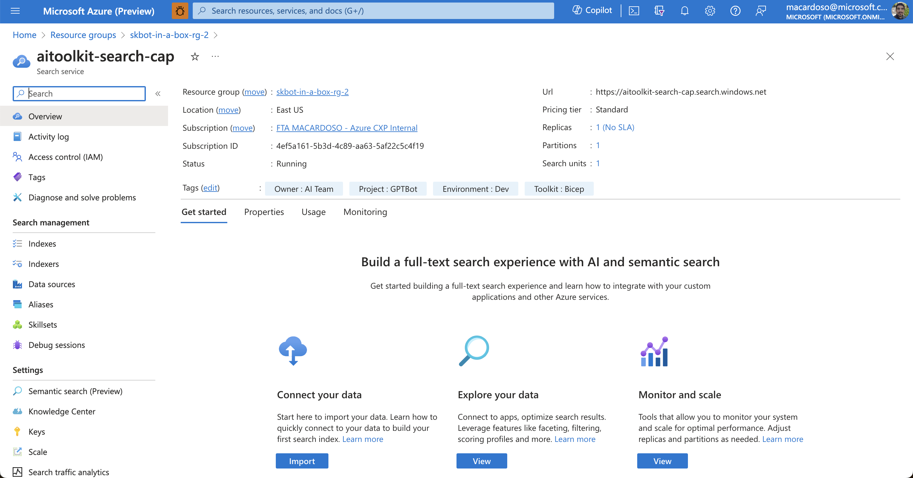
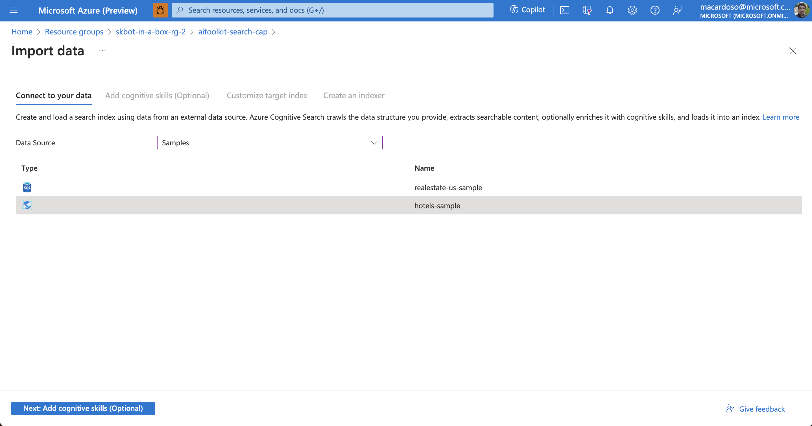
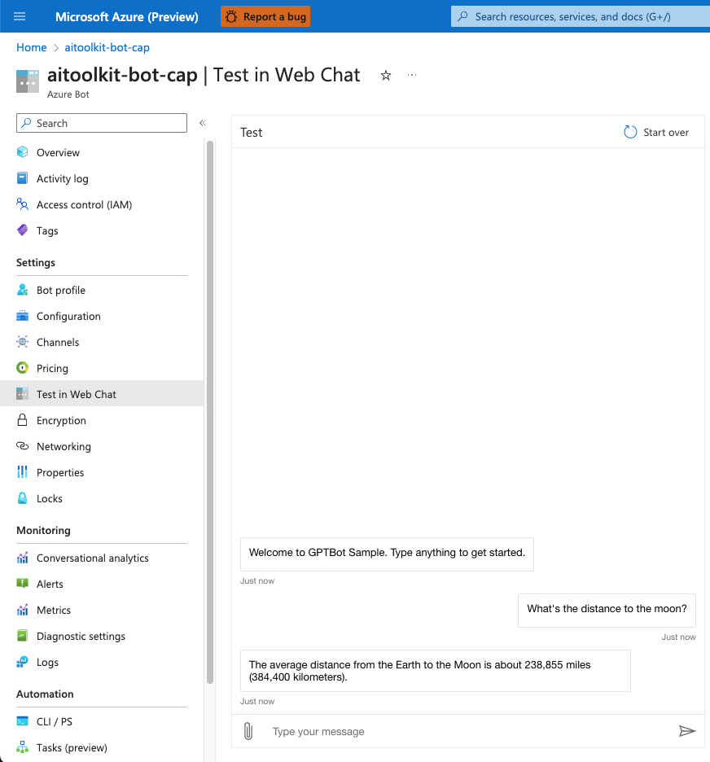
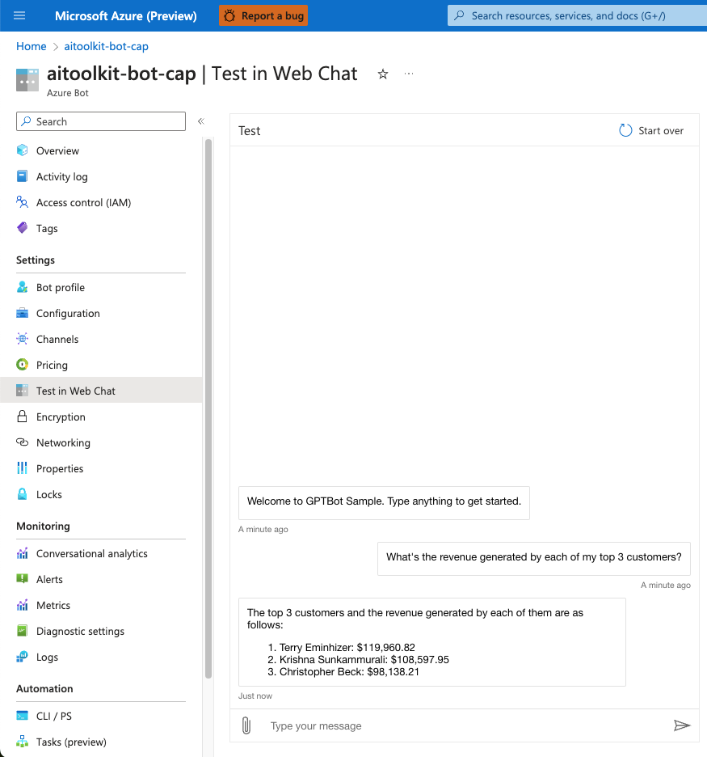
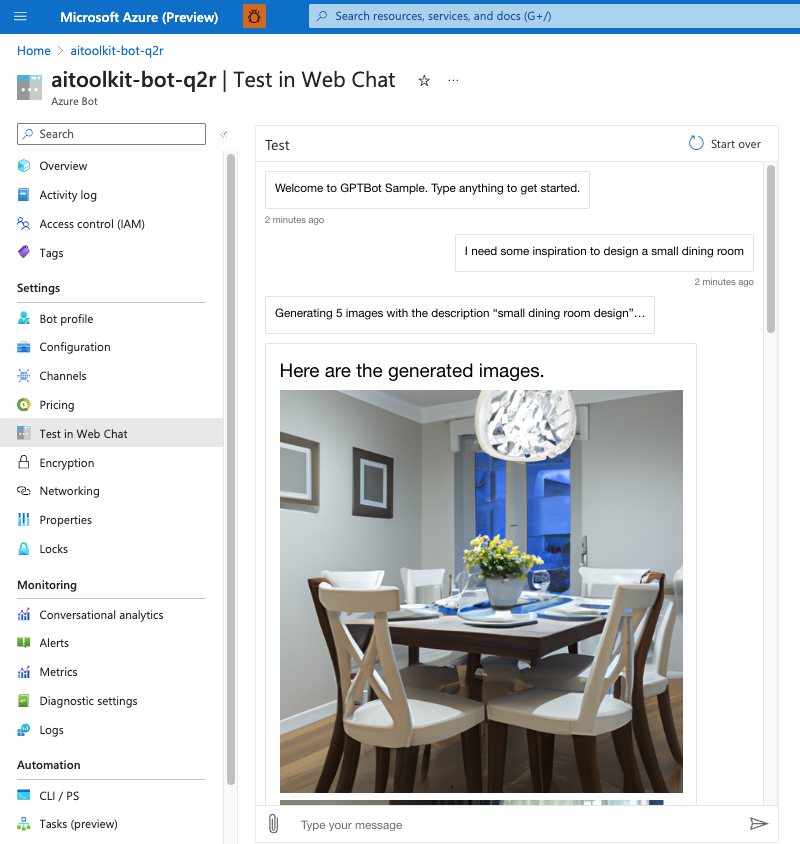
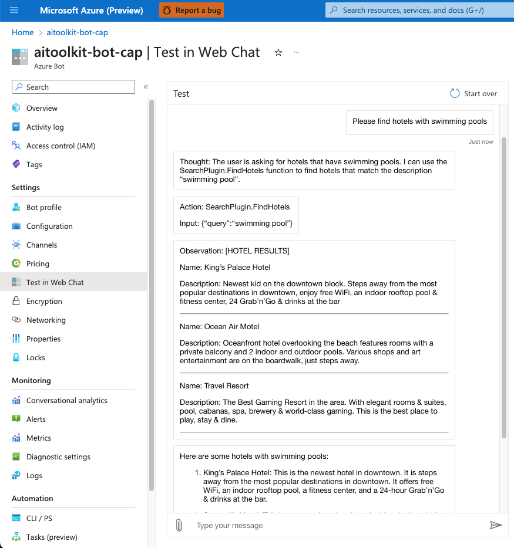

# Semantic Kernel Bot in-a-box


This project deploys an extensible Semantic Kernel bot template to Azure.

## Solution Architecture

The solution architecture is described in the diagram below.


The flow of messages is as follows:

- End-users connect to a messaging channel your bot is publised to, such as Web, a PowerBI dashboard or Teams;
- Messages get processed through Azure Bot Services, which communicates with a .NET application running on App Services.
- The .NET application runs a Semantic Kernel Stepwise Planner at its core. The planner elaborates a series of steps to process the user's request, and then executes it.
- Each step of the plan is formulated through Azure OpenAI, and the executed against Cognitive Search (traditional RAG pattern) or Azure SQL (structured data RAG).
- Cognitive search contains an index of hotels, while Azure SQL contains customer data from the AdventureWorksLT sample. Azure OpenAI is responsible for deciding which data source each question gets routed to. Questions may also span multiple data sources. Check out the Sample Scenarios section for more details.


## Pre-requisites

- For running locally:
    - [Install .NET](https://dotnet.microsoft.com/en-us/download);
    - [Install Bot Framework Emulator](https://github.com/Microsoft/BotFramework-Emulator);

- For deploying to Azure:
    - Install Azure CLI
    - Log into your Azure subscription

    ```
    az login
    ```

## Deploy to Azure

1. Clone this repository locally: 

```
git clone https://github.com/Azure/semantic-kernel-bot-in-a-box
```

2. Create a new resource group
3. Create a new Multi-Tenant Application Registration and add a Client Secret
4. In the `infra` directory, look for the file `main.example.bicepparam`. Rename it to `main.bicepparam` and fill out the app information you just generated at the bottom. In this step, you may also disable the creation of Document Intelligence, Cognitive Search and Azure SQL. Keep in mind disabling these resources will also disable their respective plugins on the application.
5. Deploy resources: 
```
cd infra
az deployment group create --resource-group=YOUR_RG_NAME -f main.bicep --parameters main.bicepparam
```
If this step causes you any errors, try updating your Azure CLI.

6. Connect Hotels Sample Index on the Azure Cognitive Services instance


7. Deploy bot application to App Services:
```
cd src
rm -r bin obj Archive.zip
zip -r Archive.zip ./* .deployment
az webapp deployment source config-zip --resource-group "YOUR_RG_NAME" --name "YOUR_APPSERVICES_NAME" --src "Archive.zip"
```

8. Test on Web Chat - go to your Azure Bot resource on the Azure portal and look for the Web Chat feature on the left side menu.


## Running Locally (must deploy resources to Azure first)

After running the deployment template, you may also run the application locally for development and debugging.

- Go to the `src` directory and look for the `appsettings.example.json` file. Rename it to `appsettings.json` and fill out the required service credentials and URLs
- Execute the project:
```
    dotnet run
```
- Open Bot Framework Emulator and connect to http://localhost:3987/api/messages
- Don't forget to enable firewall access to any services where it may be restricted. By default, SQL Server will disable public connections.

## Sample scenarios

The application has the ability to consume information from GPT-4 itself, Cognitive Search, SQL and documents uploaded by the end user directly. Each of these data sources will be preloaded with some sample data, but you may use the connections as templates to connect your own data sources.

You may ask about the following topics to test each functionality

1. General knowledge questions
    - Ask about any publicly available knowledge;


2. Retrieval-augmented generation (SearchPlugin)
    - Ask to look for hotels matching a description;


3. Structured data retrieval (SQLPlugin)
    - Ask about your customers and sales;


4. Upload documents as context (UploadPlugin)
    - Upload a file and ask questions about it;


5. Generate images (DALLEPlugin)
    - Ask to generate images;



## Keywords

- Send "clear" to reset the conversation context;


## Debugging intermediate thoughts

This project comes with a built-in debug tool that can output the Semantic Kernel Planner's intermediate steps, such as thoughts, actions and observations. You may turn on this feature by switching the DEBUG environment variable to "true".



## Developing your own plugins

This project comes with two plugins, which may be found in the Plugins/ directory. You may use these plugins as examples when developing your own plugins.

To create a custom plugin:

- Add a new file to the Plugins directory. Use one of the examples as a template.
- Add your code to the plugin. Each Semantic Function should contain a top-level description, and a description of each argument, so that Semantic Kernel may understand how to leverage that functionality.
- Load your plugin in the Bots/SKBot.cs file

And you're done! Redeploy your app and Semantic Kernel will now use your plugin whenever the user's questions call for it.
